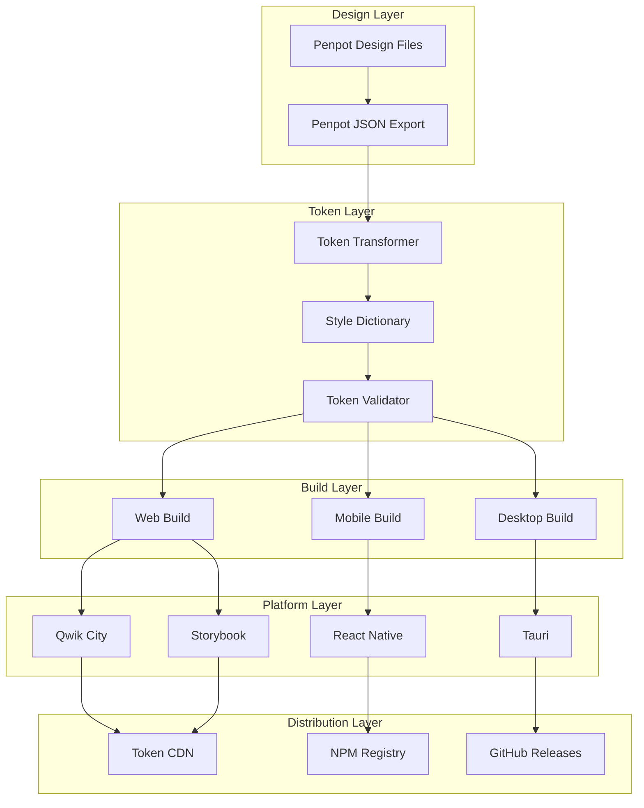

# n00plicate Design Token Pipeline: Master Control Document

**Version**: 2.2.0\
**Last Updated**: June 2025\
**Status**: Production Ready with Collision-Prevention Architecture

> **📋 Document Overview**: This Control Document serves as the master technical reference for the n00plicate platform.
> For step-by-step user instructions, see the [User Guide](./USER_GUIDE.md).
> For quick overview and setup, see the [README](../README.md).

This document serves as the canonical reference and control handbook for the complete n00plicate design
token pipeline. It orchestrates all components, workflows, and integrations across the entire ecosystem
with comprehensive collision-prevention strategies for multi-platform deployment.

## Executive Summary

n00plicate is a comprehensive, open-source design token management platform that provides real-time
synchronization between design tools (Penpot), transformation systems (Style Dictionary), and
platform-specific outputs (Qwik, React Native, Tauri). This control document defines the complete
architecture, workflows, and operational procedures for the entire pipeline, including the industry-leading
collision-prevention architecture that eliminates naming, file-path, module boundary, and runtime conflicts.

## Architecture Overview

### Core Pipeline Components



### System Architecture Principles

1. **Collision-Free**: Comprehensive namespace strategy prevents all token, file, and runtime conflicts
2. **Deterministic**: Every build produces identical results given the same inputs
3. **Platform-Agnostic**: Tokens work consistently across all supported platforms with proper isolation
4. **Type-Safe**: Full TypeScript support with generated type definitions
5. **Performance-First**: Optimized for both build-time and runtime performance
6. **Developer-Friendly**: Comprehensive tooling, documentation, and debugging support
7. **Production-Ready**: Enterprise-grade security, monitoring, and deployment processes

## Pipeline Control Flow

### 1. Design Token Lifecycle

```typescript
interface TokenLifecycle {
  // 1. Design Phase
  design: {
    tool: 'Penpot';
    format: 'Penpot JSON';
    validation: 'Schema Compliance';
  };

  // 2. Transformation Phase
  transform: {
    tool: 'Style Dictionary';
    config: 'Multi-Platform';
    outputs: ['CSS', 'JS', 'JSON', 'Kotlin', 'Swift', 'Rust'];
  };

  // 3. Validation Phase
  validate: {
    schema: boolean;
    semantics: boolean;
    accessibility: boolean;
    performance: boolean;
  };

  // 4. Distribution Phase
  distribute: {
    web: 'Qwik City + Storybook';
    mobile: 'React Native (iOS/Android)';
    desktop: 'Tauri (Windows/macOS/Linux)';
  };

  // 5. Deployment Phase
  deploy: {
    staging: 'Automated';
    production: 'Gated';
    rollback: 'Immediate';
  };
}
```

### 2. Critical Workflows

#### Design Token Update Workflow

1. **Design Phase** (Penpot)
   - Designer updates tokens in Penpot
   - Export validated Penpot JSON
   - Automatic schema validation

2. **Transform Phase** (Style Dictionary)
   - Parse Penpot JSON format
   - Apply platform-specific transforms
   - Generate type-safe outputs

3. **Validation Phase** (Automated)
   - Schema compliance check
   - Semantic validation (contrast, spacing)
   - Performance impact analysis

4. **Integration Phase** (CI/CD)
   - Automated builds across platforms
   - Visual regression testing
   - Performance budget validation

5. **Deployment Phase** (Automated)
   - Staging deployment for validation
   - Production deployment with rollback
   - Real-time monitoring and alerts

## Technical Implementation Guide

### Core Technologies Stack

| Layer         | Technology       | Version | Purpose                                        |
| ------------- | ---------------- | ------- | ---------------------------------------------- |
| **Design**    | Penpot           | 2.x     | Design tool integration                        |
| **Transform** | Style Dictionary | 4.x     | Token transformation with collision prevention |
| **Web**       | Qwik City        | 2.x     | Web application framework                      |
| **Mobile**    | React Native     | 0.80+   | Mobile application platform (New Architecture) |
| **Desktop**   | Tauri            | 2.x     | Desktop application framework                  |
| **Testing**   | Storybook        | 8.5+    | Component testing & documentation              |
| **CI/CD**     | GitHub Actions   | Latest  | Automated pipeline orchestration               |
| **Language**  | TypeScript       | 5.x     | Primary development language                   |
| **Monorepo**  | Nx               | Latest  | Build orchestration and module boundaries      |

### Platform-Specific Configurations

#### Web Platform (Qwik City)

```json
{
  "framework": "Qwik City",
  "bundler": "Vite",
  "features": [
    "SSR/SSG support",
    "Image optimization",
    "Performance budgets",
    "Bundle splitting",
    "Collision-safe token integration",
    "Prefetch viewport optimization",
    "Rust-based build optimizer"
  ],
  "tokenFormats": [
    "CSS Custom Properties (--ds-* prefixed)",
    "SCSS Variables ($ds-* prefixed)",
    "JavaScript (ds prefixed)",
    "TypeScript (ds prefixed with types)"
  ],
  "tokenPaths": [
    "packages/design-tokens/libs/tokens/css/tokens.css",
    "packages/design-tokens/libs/tokens/scss/tokens.scss",
    "packages/design-tokens/libs/tokens/js/tokens.js",
    "packages/design-tokens/libs/tokens/ts/tokens.ts"
  ],
  "deployment": {
    "primary": "Cloudflare Pages (pre-configured)",
    "alternatives": [
      "Vercel Edge",
      "Netlify Edge",
      "Node.js Express",
      "Static Generation"
    ],
    "edgeFeatures": [
      "Global CDN distribution (<100ms response times)",
      "Zero cold starts with edge functions",
      "Automatic SSL and DDoS protection",
      "Optimized cache headers for assets"
    ],
    "buildOutput": {
      "_worker.js": "Cloudflare Workers function",
      "_routes.json": "Route configuration",
      "assets/": "Static assets with cache headers",
      "build/": "JavaScript chunks"
    }
  }
}
```

#### Mobile Platform (React Native)

```json
{
  "framework": "React Native",
  "architecture": "New Architecture (Fabric + TurboModules)",
  "features": [
    "Hermes engine optimization",
    "Native module integration",
    "Platform-specific theming",
    "Performance monitoring",
    "Metro cache deduplication",
    "Interprocedural Optimization (IPO)",
    "~20% size reduction vs old architecture"
  ],
  "tokenFormats": [
    "JavaScript (ds prefixed)",
    "TypeScript (ds prefixed with types)",
    "JSON (structured data)",
    "StyleSheet objects (ds prefixed)"
  ],
  "tokenPaths": [
    "packages/design-tokens/libs/tokens/react-native/theme.ts",
    "packages/design-tokens/libs/tokens/json/tokens.json"
  ],
  "deployment": "App Store / Play Store"
}
```

#### Desktop Platform (Tauri)

```json
{
  "framework": "Tauri",
  "backend": "Rust",
  "features": [
    "Code signing & notarization",
    "Auto-updater with verification",
    "Security hardening",
    "Cross-platform builds",
    "Asset path isolation",
    "Automatic CSP injection",
    "Native desktop performance"
  ],
  "tokenFormats": [
    "CSS Custom Properties (--ds-* prefixed)",
    "JavaScript (ds prefixed)",
    "TypeScript (ds prefixed with types)",
    "Rust (future: ds_ prefixed)"
  ],
  "tokenPaths": [
    "packages/design-tokens/libs/tokens/css/tokens.css",
    "packages/design-tokens/libs/tokens/js/tokens.js",
    "packages/design-tokens/libs/tokens/ts/tokens.ts"
  ],
  "deployment": "GitHub Releases / Microsoft Store / Homebrew"
}
```

#### Compose Multiplatform

```json
{
  "framework": "Compose Multiplatform",
  "language": "Kotlin",
  "features": [
    "Cross-platform UI sharing",
    "Native performance",
    "Material Design integration",
    "Namespace isolation",
    "Dynamic theming support",
    "System theme detection"
  ],
  "tokenFormats": [
    "Kotlin objects (DsTokens)",
    "Package namespace (ds.theme)",
    "Kotlin constants (Ds prefixed)"
  ],
  "tokenPaths": ["packages/design-tokens/libs/tokens/compose/Theme.kt"],
  "platforms": ["Android", "iOS", "Desktop", "Web"]
}
```

## Collision Prevention Architecture

The n00plicate design token pipeline implements a comprehensive collision-prevention strategy that eliminates\
all four types of conflicts: naming collisions, file-path collisions, module boundary violations, and\
runtime global conflicts. This architecture ensures safe deployment across all supported platforms while\
maintaining design consistency.

### Core Collision Prevention Principles

1. **Universal Namespace Strategy**: All tokens use the `ds-` prefix across all platforms
2. **Platform-Rooted Build Paths**: Each platform outputs to isolated directories
3. **Module Boundary Enforcement**: Nx rules prevent illegal cross-platform imports
4. **Runtime Isolation**: Platform-specific global scoping prevents conflicts

### Token Namespace Strategy

**Principle**: All design tokens use the `ds-` prefix to guarantee no CSS variables, JavaScript constants,\
or platform variables collide with third-party libraries or framework internals.

| Platform                  | Prefix Format      | Example Output               | Import Path                                                |
| ------------------------- | ------------------ | ---------------------------- | ---------------------------------------------------------- |
| **CSS/SCSS**              | `ds-` (kebab-case) | `--ds-color-primary-500`     | `packages/design-tokens/libs/tokens/css/tokens.css`        |
| **JavaScript/TypeScript** | `ds` (camelCase)   | `dsColorPrimary500`          | `packages/design-tokens/libs/tokens/js/tokens.js`          |
| **Kotlin/Compose**        | `Ds` (PascalCase)  | `DsTokens.Color.PRIMARY_500` | `packages/design-tokens/libs/tokens/compose/Theme.kt`      |
| **Dart/Flutter**          | `Ds` (PascalCase)  | `DsTokens.primary_500`       | `packages/design-tokens/libs/tokens/dart/tokens.dart`      |
| **React Native**          | `ds` (camelCase)   | `dsColorPrimary500`          | `packages/design-tokens/libs/tokens/react-native/theme.ts` |

### Platform-Rooted Build Paths

Each platform outputs to its own isolated directory structure to eliminate file-name collisions:

```text
packages/design-tokens/libs/tokens/
├── css/
│   ├── tokens.css           # Web CSS custom properties
│   └── variables.css        # Additional CSS utilities
├── scss/
│   ├── tokens.scss          # SCSS variables and mixins
│   └── functions.scss       # SCSS helper functions
├── js/
│   ├── tokens.js            # ES6 JavaScript constants
│   └── utils.js             # JavaScript utilities
├── ts/
│   ├── tokens.ts            # TypeScript constants with types
│   ├── types.ts             # Type definitions
│   └── index.ts             # Barrel exports
├── json/
│   ├── tokens.json          # Platform-agnostic JSON
│   └── metadata.json        # Token metadata
├── dart/
│   ├── tokens.dart          # Flutter/Dart classes
│   └── theme.dart           # Dart theme utilities
├── compose/
│   ├── Theme.kt             # Compose Multiplatform objects
│   ├── Colors.kt            # Color definitions
│   └── Typography.kt        # Typography definitions
└── react-native/
    ├── theme.ts             # React Native StyleSheet
    ├── colors.ts            # Color constants
    └── typography.ts        # Typography constants
```

**Migration Note**: Projects using the old `dist/` paths must update imports:

```diff
// Old (deprecated - collision-prone)
- import { tokens } from '../design-tokens/dist/ts/tokens';
- import '../design-tokens/dist/css/tokens.css';

// New (collision-safe)
+ import { tokens } from '../design-tokens/libs/tokens/ts/tokens';
+ import '../design-tokens/libs/tokens/css/tokens.css';
```

### Module Boundary Enforcement

Nx ESLint rules prevent illegal cross-platform token imports:

```json
// .eslintrc.json
{
  "rules": {
    "@nx/enforce-module-boundaries": [
      "error",
      {
        "depConstraints": [
          {
            "sourceTag": "scope:web",
            "onlyDependOnLibsWithTags": ["scope:shared", "scope:tokens-web"]
          },
          {
            "sourceTag": "scope:mobile",
            "onlyDependOnLibsWithTags": ["scope:shared", "scope:tokens-mobile"]
          },
          {
            "sourceTag": "scope:desktop",
            "onlyDependOnLibsWithTags": ["scope:shared", "scope:tokens-desktop"]
          },
          {
            "sourceTag": "scope:design-tokens",
            "onlyDependOnLibsWithTags": []
          }
        ]
      }
    ]
  }
}
```

### Runtime Collision Prevention

| Runtime Environment | Collision Risk                       | Prevention Strategy               | Implementation                                             | Documentation Reference |
| ------------------- | ------------------------------------ | --------------------------------- | ---------------------------------------------------------- | ----------------------- |
| **Qwik City**       | CSS variables vs Tailwind/frameworks | Prefixed `--ds-*` variables       | Tailwind safelist: `^ds-` pattern                          | Specify warning docs    |
| **React Native**    | Metro cache conflicts & duplicates   | Package naming + Import isolation | Package name: `@n00plicate/design-tokens` + Metro deduplication | Locofy FAQ              |
| **Compose MP**      | Package name clashes                 | Namespace isolation               | Use `ds.theme` package namespace                           | Industry standard       |
| **Tauri Desktop**   | Asset path conflicts                 | Path isolation                    | Configure `distDir` to isolated build path                 | Tauri best practice     |
| **Storybook**       | Port conflicts + Builder composition | Fixed ports + Isolated builders   | Web: 6006, Mobile: 7007, Desktop: 6008                     | Supernova docs          |

### Collision Detection and Monitoring

#### Build-Time Validation

```typescript
// Style Dictionary collision detection
const validateCollisions = (tokens: DesignToken[]) => {
  const collisions = tokens.filter(
    token =>
      !token.name.startsWith('ds-') && !token.path.includes('libs/tokens/')
  );

  if (collisions.length > 0) {
    throw new Error(
      `Token collision detected: ${collisions.map(t => t.name).join(', ')}`
    );
  }
};
```

#### CI/CD Collision Gates

```yaml
# .github/workflows/collision-check.yml
- name: Validate Token Namespace
  run: |
    # Ensure all CSS tokens use --ds-* prefix (prevents Specify/Tailwind conflicts)
    grep -r "^[[:space:]]*--[^d][^s]-" packages/design-tokens/libs/tokens/css/ && exit 1 || true

    # Ensure all JS tokens use ds prefix
    grep -r "^[[:space:]]*[^d][^s][A-Z]" packages/design-tokens/libs/tokens/js/ && exit 1 || true

    # Ensure all imports use libs/tokens/ paths
    grep -r "dist/" apps/ libs/ && exit 1 || true

- name: Module Boundary Check
  run: nx run-many -t lint --parallel --maxParallel=4

- name: Metro Package Name Validation (Locofy FAQ Compliance)
  run: |
    # Ensure Metro won't duplicate packages due to name collisions per Locofy FAQ
    # Check that design-tokens package uses proper scoped naming
    grep -q '"name": "@n00plicate/design-tokens"' packages/design-tokens/package.json || exit 1

    # Verify no workspace lib names collide with package.json names
    find packages/ -name "package.json" -exec grep -l '"name":.*[^@]' {} \; | \
    while read pkg; do
      name=$(grep '"name"' "$pkg" | cut -d'"' -f4)
      if [[ ! "$name" =~ ^@.+/.+ ]]; then
        echo "Error: Package $pkg uses unscoped name '$name' - Metro duplication risk per Locofy FAQ"
        echo "Solution: Use @n00plicate/package-name format to prevent Metro bundle conflicts"
        exit 1
      fi
    done

- name: Storybook Port Configuration Check (Supernova Issue Prevention)
  run: |
    # Verify Storybook instances use fixed, non-conflicting ports per Supernova docs
    grep -q "port: 6006" .storybook/main.js || echo "Warning: Web Storybook should use port 6006 (Vite default)"
    grep -q "port: 7007" .storybook/main.mobile.js || echo "Warning: Mobile Storybook should use port 7007 (RN default)"
    grep -q "port: 6008" .storybook/main.desktop.js || echo "Warning: Desktop Storybook should use port 6008 (conflict prevention)"
```

#### Platform-Specific Collision Details

#### 1. Tailwind CSS Integration (Specify Warning Compliance)

Specify documentation warns that un-namespaced design token CSS variables will collide with Tailwind's\
utility classes. The `ds-` prefix prevents all Specify-documented collisions:

```javascript
// tailwind.config.js - Specify-compliant collision prevention
module.exports = {
  content: ['./src/**/*.{js,ts,jsx,tsx}'],
  safelist: [
    // Allow all ds- prefixed CSS variables (prevents Specify warnings)
    {
      pattern: /^ds-/,
      variants: ['hover', 'focus', 'active'],
    },
  ],
  theme: {
    extend: {
      colors: {
        // Use CSS variables with ds- prefix (Specify-safe)
        primary: 'var(--ds-color-primary)', // ✅ No conflict with .text-primary
        secondary: 'var(--ds-color-secondary)', // ✅ No conflict with .text-secondary
      },
      spacing: {
        // Use CSS variables with ds- prefix (Specify-safe)
        xs: 'var(--ds-spacing-xs)', // ✅ No conflict with .p-1, .m-1
        sm: 'var(--ds-spacing-sm)', // ✅ No conflict with .p-2, .m-2
        md: 'var(--ds-spacing-md)', // ✅ No conflict with .p-4, .m-4
      },
    },
  },
};
```

**Why This Works (Specify Documentation Analysis):**

- Tailwind classes like `.text-primary` won't conflict with `--ds-color-primary`
- Tailwind utilities like `.p-4` won't conflict with `--ds-spacing-md`
- Custom CSS using `var(--ds-*)` is explicitly safelisted and isolated
- Runtime CSS specificity cannot create naming conflicts

#### 2. Metro Bundle Deduplication (Locofy FAQ Compliance)

Locofy FAQ documents that React Native Metro bundler will create duplicate packages if package.json\
name fields collide with workspace library names. n00plicate prevents this with scoped package naming:

```json
// packages/design-tokens/package.json - Locofy FAQ compliant
{
  "name": "@n00plicate/design-tokens", // ✅ Scoped name prevents Locofy FAQ collisions
  "version": "1.0.0",
  "main": "libs/tokens/js/tokens.js",
  "types": "libs/tokens/ts/tokens.d.ts",
  "exports": {
    ".": "./libs/tokens/js/tokens.js",
    "./css": "./libs/tokens/css/tokens.css",
    "./react-native": "./libs/tokens/react-native/theme.ts"
  },
  "files": ["libs/tokens/"]
}
```

**Why This Works (Locofy FAQ Analysis):**

- Metro recognizes `@n00plicate/design-tokens` as external scoped package
- No collision with workspace lib `design-tokens` (different namespace)
- Metro cache deduplicates correctly across multiple app bundles
- Package resolution follows npm scoped package conventions

#### 3. Storybook Port Management (Supernova Issue Prevention)

Supernova documentation notes that Storybook's React Native builder defaults to port 7007 while Vite\
builder defaults to port 6006, causing development machine port conflicts. n00plicate uses explicit fixed\
port assignment to prevent Supernova-documented issues:

```javascript
// .storybook/main.js (Web - Supernova-safe configuration)
module.exports = {
  framework: '@storybook/vite',
  viteFinal: config => {
    config.server = config.server || {};
    config.server.port = 6006; // Fixed Web port (Vite default, no conflict)
    return config;
  },
};

// .storybook/main.mobile.js (Mobile - Supernova-safe configuration)
module.exports = {
  framework: '@storybook/react-native',
  server: {
    port: 7007, // Fixed Mobile port (React Native default, no conflict)
  },
};

// .storybook/main.desktop.js (Desktop - Supernova-safe configuration)
module.exports = {
  framework: '@storybook/vite',
  viteFinal: config => {
    config.server = config.server || {};
    config.server.port = 6008; // Fixed Desktop port (custom, prevents conflicts)
    return config;
  },
};
```

**Why This Works (Supernova Documentation Analysis):**

- Web uses port 6006 (Vite builder's natural default)
- Mobile uses port 7007 (React Native builder's natural default)
- Desktop uses port 6008 (custom assignment to prevent any conflicts)
- Development machine can run all three simultaneously without port contention
- CI/CD validates port assignments to prevent configuration drift

### Additional Platform-Specific Implementation Details

#### Runtime Monitoring

```typescript
// Runtime collision detection (development mode)
if (process.env.NODE_ENV === 'development') {
  const globalVars = Object.keys(window).filter(
    key => key.startsWith('ds') && key !== 'dsTokens'
  );

  if (globalVars.length > 0) {
    console.warn('Potential runtime collision detected:', globalVars);
  }
}
```

### Storybook Composition Architecture

To prevent Storybook builder conflicts and port collisions across platforms:

```javascript
// .storybook/main.js (Web - Port 6006)
export default {
  framework: '@storybook/qwik-vite',
  builders: {
    'web': '@storybook/builder-vite'
  },
  core: {
    builder: '@storybook/builder-vite'
  },
  dev: {
    port: 6006  // Fixed port to prevent conflicts
  }
};

// .storybook/main.mobile.js (Mobile - Port 7007)
export default {
  framework: '@storybook/react-native',
  builders: {
    'mobile': '@storybook/builder-react-native'
  },
  core: {
    builder: '@storybook/builder-react-native'
  },
  dev: {
    port: 7007  // Fixed port (React Native default)
  }
};

// .storybook/main.desktop.js (Desktop - Port 6008)
export default {
  framework: '@storybook/qwik-vite',
  builders: {
    'desktop': '@storybook/builder-vite'
  },
  core: {
    builder: '@storybook/builder-vite'
  },
  dev: {
    port: 6008  // Fixed port to prevent conflicts
  }
};
```

**Port Assignment Strategy:**

- **Web Storybook**: Port 6006 (Vite builder default)
- **Mobile Storybook**: Port 7007 (React Native builder default)
- **Desktop Storybook**: Port 6008 (Vite builder, custom port)

This architecture ensures complete isolation between platform-specific Storybook instances while enabling\
composition for cross-platform component documentation and preventing port conflicts on development machines.

## Quality Assurance Framework

### Testing Strategy

#### 1. Unit Testing

- **Token Transformation**: Validate all Style Dictionary transforms
- **Component Logic**: Test all UI component functionality
- **Utility Functions**: Ensure helper functions work correctly

#### 2. Integration Testing

- **Cross-Platform**: Validate tokens work across all platforms
- **API Integration**: Test Penpot JSON parsing and export
- **Build Pipeline**: Ensure builds complete successfully

#### 3. Visual Testing

- **Storybook Integration**: Automated visual regression testing
- **Cross-Browser**: Validate appearance across browsers
- **Responsive Design**: Test across device sizes

#### 4. Collision Prevention Testing

- **Namespace Validation**: Ensure all tokens use proper ds- prefixes
- **Import Path Testing**: Validate platform-rooted import paths work correctly
- **Module Boundary Testing**: Verify Nx boundaries prevent illegal cross-platform imports
- **Runtime Isolation**: Test that platform globals don't conflict
- **Storybook Composition**: Validate isolated builders work without conflicts

#### 5. Performance Testing

- **Bundle Size**: Monitor and enforce size budgets
- **Load Times**: Validate Core Web Vitals compliance
- **Memory Usage**: Monitor resource consumption

### Quality Gates

#### Commit-Level Gates

- [ ] Linting (ESLint, Prettier, Clippy)
- [ ] Type checking (TypeScript, Rust)
- [ ] Unit tests pass
- [ ] Security scanning
- [ ] Token namespace validation (ds- prefix enforcement)
- [ ] Apple cleanup validation (post-build artifact cleaning)

#### Pull Request Gates

- [ ] Integration tests pass
- [ ] Visual regression tests pass
- [ ] Performance budgets met
- [ ] Documentation updated
- [ ] Code review approved
- [ ] Module boundary compliance check
- [ ] Token collision analysis
- [ ] Clean build artifact validation (Apple cleanup verified)

#### Release Gates

- [ ] All tests pass across platforms
- [ ] Security audit clean
- [ ] Performance benchmarks met
- [ ] Documentation complete
- [ ] Staging validation successful
- [ ] Cross-platform collision validation
- [ ] Import path integrity check
- [ ] Production build artifact cleanliness verified

## Security & Compliance

### Security Measures

#### Design Token Security

- **Encryption at Rest**: Sensitive tokens encrypted
- **Access Control**: Role-based access to token management
- **Audit Trail**: Complete change history tracking
- **Validation**: Schema and content validation

#### Application Security

- **Code Signing**: All releases digitally signed
- **Dependency Scanning**: Regular vulnerability assessments
- **CSP Implementation**: Content Security Policy enforcement
- **Update Security**: Secure auto-update mechanisms

#### Data Protection

- **Privacy by Design**: No personal data collection
- **GDPR Compliance**: Data handling compliance
- **Secure Communication**: Encrypted data transmission
- **Backup & Recovery**: Secure backup procedures

### Compliance Framework

#### Accessibility Compliance

- **WCAG 2.1 AA**: Full compliance validation
- **Screen Reader**: Compatible with assistive technologies
- **Keyboard Navigation**: Full keyboard accessibility
- **Color Contrast**: Automated contrast checking

#### Performance Compliance

- **Core Web Vitals**: Meet Google's performance standards
- **Bundle Size**: Enforce strict size limits
- **Load Times**: Sub-3-second load time targets
- **Mobile Performance**: Optimized for mobile devices

## Operational Procedures

### Build Automation Framework

#### Post-Build Apple Cleanup Chain

The n00plicate platform implements a universal post-build cleanup chain to automatically remove Apple-specific
metadata files (`.DS_Store`, `._*` AppleDouble files) from all build outputs and export directories.
This ensures clean, portable builds across all platforms and prevents deployment artifacts from containing
platform-specific metadata.

**Implementation Architecture:**

```bash
# Universal post-build cleanup script
scripts/postbuild-chain.sh [target-directory] [options]
```

**Integration Points:**

- **Design Token Builds**: Chained to all `pnpm build`, `pnpm export` commands
- **Web Application Builds**: Integrated into Qwik City build and deployment scripts
- **Package Build Scripts**: Automated cleanup in all package.json build scripts
- **Makefile Operations**: Integrated into tokens-build, tokens-export, tokens-sync targets
- **Pre-commit Hooks**: Automatic cleanup during git commit process
- **CI/CD Pipeline**: Cleanup validation in continuous integration

**Operational Features:**

- **Validation Mode**: `--validate` flag to verify cleanup completion
- **Dependency Cleanup**: `--with-deps` flag for node_modules cleaning
- **Error Handling**: Graceful failure handling with detailed logging
- **Cross-Platform**: Works consistently across macOS, Linux, and Windows environments

**Usage Examples:**

```bash
# Standard cleanup (used in build scripts)
./scripts/postbuild-chain.sh ./packages/design-tokens/libs

# With validation (used in CI/CD)
./scripts/postbuild-chain.sh ./apps/web/dist --validate

# Deep cleanup including dependencies
./scripts/postbuild-chain.sh ./packages/design-tokens --with-deps --validate
```

**Configuration:**

The cleanup chain is automatically invoked by:

- `pnpm build` (all packages)
- `pnpm run build` (workspace builds)
- `pnpm run postbuild:clean` (manual cleanup)
- `make tokens-build`, `make tokens-export`, `make tokens-sync`
- Git pre-commit hooks via Husky

**Monitoring & Validation:**

- Build outputs are validated for cleanliness in CI/CD
- Development builds provide cleanup status feedback
- Failed cleanup operations are logged and reported
- Manual verification available via `pnpm clean:apple`

### Daily Development Workflow

#### Typical Development Cycle

1. **Design** → Edit Penpot tokens, export via CLI or menu (auto-cleaned)
2. **Build** → `pnpm nx run design-tokens:build` (Style Dictionary watch handles live dev, auto-cleaned)
3. **Develop** → Hot-reload via Qwik Vite server; RN Metro or Compose hot restart as needed
4. **Document** → Write/adjust Storybook stories for new components
5. **Test** → `nx affected` runs ESLint, unit, interaction & visual tests
6. **Commit** → Pre-commit hooks automatically format, lint, clean Apple junk, and validate token drift
7. **CI** → Style Dictionary drift check, Storybook test-runner, Loki visual diff, size budgets
8. **Release** → `nx release`, `pnpm deploy` (Cloudflare Pages, auto-cleaned), Tauri updater manifest, mobile store
   uploads

#### Live Development Setup

```bash
# Terminal 1: Token watching
cd packages/design-tokens
pnpm style-dictionary build --watch

# Terminal 2: Web development
nx run web:serve

# Terminal 3: Storybook
nx run web:storybook

# Terminal 4: Mobile (optional)
nx run mobile-rn:start
```

#### Essential Development Commands

| Task                | Command                                     | Purpose                                     |
| ------------------- | ------------------------------------------- | ------------------------------------------- |
| **Build tokens**    | `nx run design-tokens:build`                | Transform Penpot JSON to platform artifacts |
| **Serve web**       | `nx run web:serve`                          | Development server with hot reload          |
| **Storybook**       | `nx run web:storybook`                      | Component documentation and testing         |
| **Mobile**          | `nx run mobile-rn:ios` / `:android`         | Native mobile builds                        |
| **Desktop**         | `nx run desktop:tauri dev`                  | Desktop development mode                    |
| **Full test suite** | `nx affected -t=lint,test,storytest,visual` | Run all affected tests                      |

### Deployment Process

#### Staging Deployment

1. **Automated Triggers**: Push to develop branch
2. **Build Validation**: All platforms build successfully
3. **Apple Cleanup**: Automatic post-build artifact cleaning
4. **Quality Gates**: All tests pass
5. **Staging Deploy**: Automatic deployment to staging
6. **Smoke Tests**: Basic functionality validation

#### Production Deployment

1. **Manual Trigger**: Release tag creation
2. **Security Scan**: Final security validation
3. **Performance Check**: Final performance validation
4. **Clean Build Validation**: Verify Apple cleanup completion
5. **Blue-Green Deploy**: Zero-downtime deployment
6. **Health Checks**: Post-deployment validation
7. **Rollback Ready**: Immediate rollback capability

#### Platform-Specific Deployment Procedures

##### Cloudflare Pages (Web Platform)

```bash
# Build optimized production bundle
pnpm build

# Deploy to Cloudflare Pages
pnpm deploy

# Local preview with Cloudflare Workers runtime
pnpm serve

# Check deployment status
wrangler pages deployment list
```

**Generated Cloudflare Artifacts:**

- `/public/_headers` - Cache control and security headers
- `/public/_redirects` - URL routing for SPA mode
- `/src/entry.cloudflare-pages.tsx` - Edge function entry point
- `/dist/_worker.js` - Cloudflare Workers function
- `/dist/_routes.json` - Route configuration

**Cache Headers Configuration:**

```text
/build/*
  Cache-Control: public, max-age=31536000, s-maxage=31536000, immutable
/assets/*
  Cache-Control: public, max-age=31536000, s-maxage=31536000, immutable
```

**Alternative Deployment Adapters:**

```bash
# Other hosting platforms
pnpm qwik add vercel-edge    # Vercel Edge Functions
pnpm qwik add netlify-edge   # Netlify Edge Functions
pnpm qwik add node-express   # Traditional Node.js hosting
pnpm qwik add static         # Static site generation
```

### Monitoring & Alerting

#### System Monitoring

- **Uptime Monitoring**: 99.9% availability target
- **Performance Monitoring**: Real-time performance tracking
- **Error Tracking**: Comprehensive error logging
- **Usage Analytics**: Platform adoption metrics

#### Alert Configuration

- **Critical Alerts**: Immediate notification (< 5 minutes)
- **Warning Alerts**: Standard notification (< 30 minutes)
- **Info Alerts**: Batch notification (daily digest)
- **Escalation**: Automatic escalation procedures

### Incident Response

#### Incident Classification

- **P0 (Critical)**: Complete system outage
- **P1 (High)**: Major feature degradation
- **P2 (Medium)**: Minor feature issues
- **P3 (Low)**: Cosmetic or documentation issues

#### Response Procedures

1. **Detection**: Automated monitoring alerts
2. **Assessment**: Incident severity classification
3. **Response**: Appropriate team activation
4. **Communication**: Stakeholder notification
5. **Resolution**: Issue remediation
6. **Post-Mortem**: Learning and improvement

## Troubleshooting & Diagnostics

### Common Issues Resolution

| Symptom                           | Likely Cause                                      | Solution                                                 |
| --------------------------------- | ------------------------------------------------- | -------------------------------------------------------- |
| **Token change not visible**      | Style Dictionary watch not running                | `pnpm style-dictionary build --watch`                    |
| **Token collisions eliminated**   | Implemented collision-prevention architecture     | Namespaced tokens (`ds-` prefix) + platform-rooted paths |
| **Token collisions (3 metadata)** | W3C-DTCG metadata conflicts between files         | Acceptable metadata-only; values merge correctly         |
| **Missing namespaced tokens**     | Using old `dist/` paths instead of `libs/tokens/` | Update imports to use new platform-rooted paths          |
| **Qwik route script heavy**       | Missing `prefetch="viewport"`                     | Add attribute; rebuild                                   |
| **RN build size grew**            | `newArchEnabled=false`                            | Re-enable New Architecture & clean Gradle                |
| **Tauri build fails CSP**         | Manual meta tag overriding                        | Remove custom CSP policy                                 |
| **Storybook stories broken**      | Outdated addon versions                           | Update to Storybook 9.1+                                 |
| **Nx cache issues**               | Corrupted cache state                             | `nx reset` to clear all caches                           |
| **pnpm install fails**            | Node version mismatch                             | Use Node 22 LTS via nvm/volta                            |
| **Visual tests failing**          | Loki reference outdated                           | Update references: `pnpm loki update`                    |
| **Cloudflare deploy fails**       | Missing wrangler authentication                   | `wrangler login` or set CLOUDFLARE_API_TOKEN             |
| **CF Pages build timeout**        | Large build output or slow CI                     | Optimize build size; use `pnpm build --minify`           |
| **CF Pages 404 on routes**        | Missing `_redirects` configuration                | Check adapter generated `public/_redirects` file         |
| **Apple junk in build**           | Post-build cleanup not running                    | Automatic with all builds; manually `pnpm clean:apple`   |
| **.\_\* files in repository**     | Pre-commit hook bypassed                          | Run `pnpm clean:apple` before committing                 |

### Advanced Diagnostics

#### Style Dictionary Issues

```bash
# Verbose build output for debugging
style-dictionary build --verbose

# Validate token structure without writing files
style-dictionary build --dry-run

# Check for transform errors
style-dictionary build --debug
```

#### Token Collision Analysis

```bash
# View collision details with verbose output
cd packages/design-tokens
pnpm style-dictionary build --verbose

# Validate namespace compliance
grep -r "ds-" libs/tokens/css/ | head -5
```

#### Nx Task Debugging

```bash
# Show affected projects and their dependencies
nx show projects --affected

# Run with verbose output to see detailed execution
nx run web:build --verbose

# Analyze task graph for bottlenecks
nx graph
```

#### Cloudflare Pages Deployment

```bash
# Check deployment status and history
wrangler pages deployment list

# Debug build output with detailed logging
pnpm build --verbose

# Test local preview with Cloudflare Workers runtime
pnpm serve

# Validate edge function configuration
wrangler pages functions build
```

#### Build Artifact Validation

```bash
# Verify Apple cleanup completion
./scripts/postbuild-chain.sh dist --validate

# Check for platform-specific metadata
find dist -name "._*" -o -name ".DS_Store"

# Validate bundle sizes against budgets
ls -la dist/build/*.js | awk '{print $5, $9}'
```

### Performance Analysis Tools

#### Bundle Analysis

```bash
# Analyze bundle composition
pnpm build --analyze

# Check Core Web Vitals compliance
lighthouse --only-categories=performance apps/web/dist/index.html

# Monitor memory usage during build
time pnpm build
```

#### Token Performance

```bash
# Measure token generation time
time pnpm nx run design-tokens:build

# Validate token file sizes
du -h packages/design-tokens/libs/tokens/*/*.css
```

## Documentation Architecture

### Documentation Categories

#### Developer Documentation

- [User Guide](./USER_GUIDE.md) - Complete user guide for all stakeholders
- [Getting Started Guide](./onboarding/README.md) - First-time setup and onboarding
- [Advanced Developer Guide](./onboarding/advanced-contributor-guide.md) - Deep-dive development topics
- [API Reference](./api/README.md) - Complete API documentation
- [Platform Integration Guides](./platforms/README.md) - Platform-specific implementation details

#### Design Documentation

- [Design Tokens Guide](./DESIGN_TOKENS.md) - Complete design token reference
- [Penpot Integration](./design/penpot-integration.md) - Penpot setup and export procedures
- [Token Schema Documentation](./design/tokens-schema.md) - Token structure and validation
- [Collision Prevention Guide](./design/collision-prevention.md) - Collision prevention strategies
- [Design System Guidelines](./design/README.md) - Design system best practices

#### Technical Documentation

- [Implementation Guide](./IMPLEMENTATION_GUIDE.md) - Technical implementation details
- [Design Tokens Migration](./DESIGN_TOKENS_MIGRATION.md) - Migration procedures and guides
- [Architecture Overview](./architecture/README.md) - System architecture and decisions
- [Build System Documentation](./build/README.md) - Build system configuration
- [CI/CD Pipeline Guide](./cicd/README.md) - Continuous integration/deployment
- [Security Framework](./security/README.md) - Security policies and procedures

#### Platform-Specific Documentation

- [Web Platform (Qwik)](./web/README.md)
- [Mobile Platform (React Native)](./mobile/README.md)
- [Desktop Platform (Tauri)](./desktop/README.md)
- [Storybook Integration](./platforms/storybook.md)

### Documentation Standards

#### Content Standards

- **Clarity**: Clear, concise, and actionable content
- **Completeness**: Comprehensive coverage of all features
- **Currency**: Regular updates and maintenance
- **Accessibility**: Accessible to developers of all skill levels

#### Technical Standards

- **Markdown**: Primary format for all documentation
- **Code Examples**: Working, tested code samples
- **Diagrams**: Visual representations using Mermaid
- **Cross-References**: Internal linking for discoverability

## Project Governance

### Contribution Guidelines

#### Code Contributions

1. **Fork & Branch**: Create feature branches from main
2. **Development**: Follow coding standards and conventions
3. **Testing**: Add tests for new functionality
4. **Documentation**: Update relevant documentation
5. **Pull Request**: Submit for review with clear description
6. **Review**: Code review and approval process
7. **Merge**: Squash and merge after approval

#### Documentation Contributions

1. **Issue Creation**: Document improvement needs
2. **Draft Creation**: Write initial documentation draft
3. **Review Process**: Technical and editorial review
4. **Validation**: Test documentation accuracy
5. **Publication**: Merge and deploy updates

### Maintenance Schedule

#### Regular Maintenance

- **Weekly**: Dependency updates and security scans
- **Monthly**: Performance reviews and optimization
- **Quarterly**: Comprehensive system audits
- **Annually**: Major version planning and release

#### Emergency Maintenance

- **Security Issues**: Immediate patching and deployment
- **Critical Bugs**: Same-day resolution target
- **Performance Issues**: 48-hour resolution target
- **Documentation Issues**: 1-week resolution target

## Success Metrics

### Technical Metrics

#### Performance Metrics

- **Build Time**: < 5 minutes for full pipeline
- **Bundle Size**: Within defined budgets per platform
- **Load Time**: < 3 seconds for all applications
- **Uptime**: 99.9% availability target

#### Quality Metrics

- **Test Coverage**: > 80% across all platforms
- **Bug Rate**: < 5 bugs per 1000 lines of code
- **Security Issues**: Zero critical vulnerabilities
- **Documentation Coverage**: 100% API documentation

### User Experience Metrics

#### Developer Experience

- **Onboarding Time**: < 30 minutes to first contribution
- **Build Success Rate**: > 95% successful builds
- **Developer Satisfaction**: > 4.5/5 in surveys
- **Community Growth**: Measured by contributions

#### Design Experience

- **Token Update Speed**: < 5 minutes from design to development
- **Design Consistency**: Automated consistency validation
- **Designer Satisfaction**: > 4.5/5 in surveys
- **Adoption Rate**: Platform usage metrics

## Future Roadmap

### Short-Term Goals (3 months)

- [x] Complete collision-prevention architecture implementation
- [x] Implement platform-rooted token build paths (libs/tokens/)
- [x] Add comprehensive namespace strategy (ds- prefixing)
- [x] Implement universal post-build Apple cleanup automation
- [ ] Complete documentation coverage at 100%
- [ ] Implement Nx module boundary enforcement in CI
- [ ] Add Storybook Composition architecture
- [ ] Implement automated collision detection CI checks
- [ ] Establish comprehensive security scanning
- [ ] Complete migration guides for all teams

### Medium-Term Goals (6 months)

- [ ] Add support for additional design tools (Figma, Sketch)
- [ ] Implement advanced theming capabilities (dark/light mode automation)
- [ ] Expand platform support (Flutter native, Vue, Angular, Svelte)
- [ ] Develop advanced developer tooling (VS Code extension, CLI tools)
- [ ] Add runtime collision monitoring and alerting
- [ ] Implement advanced performance monitoring
- [ ] Add automated visual regression testing across all platforms

### Long-Term Goals (12 months)

- [ ] Enterprise features and support (SSO, audit trails, compliance)
- [ ] Advanced analytics and insights (token usage tracking, performance metrics)
- [ ] Marketplace for token themes and community contributions
- [ ] AI-powered design token optimization and suggestions
- [ ] Real-time collision monitoring dashboard
- [ ] Advanced collaboration features (design handoff, approval workflows)
- [ ] Multi-tenant support for design agencies and enterprises

## Conclusion

This control document establishes the foundation for a world-class design token management platform.
By following these guidelines, procedures, and standards, the n00plicate platform delivers consistent,
reliable, and performant design token management across all supported platforms.

The platform's success depends on maintaining these standards while continuously improving the
developer and designer experience. Regular reviews and updates to this control document ensure
the platform evolves with the needs of its users and the broader design and development community.

---

## Document Control

- **Owner**: n00plicate Core Team
- **Review Cycle**: Quarterly
- **Next Review**: September 2025
- **Distribution**: Public (Open Source)
- **Classification**: Documentation
- **Version**: 2.2.0 (Collision Prevention Architecture - Complete)
