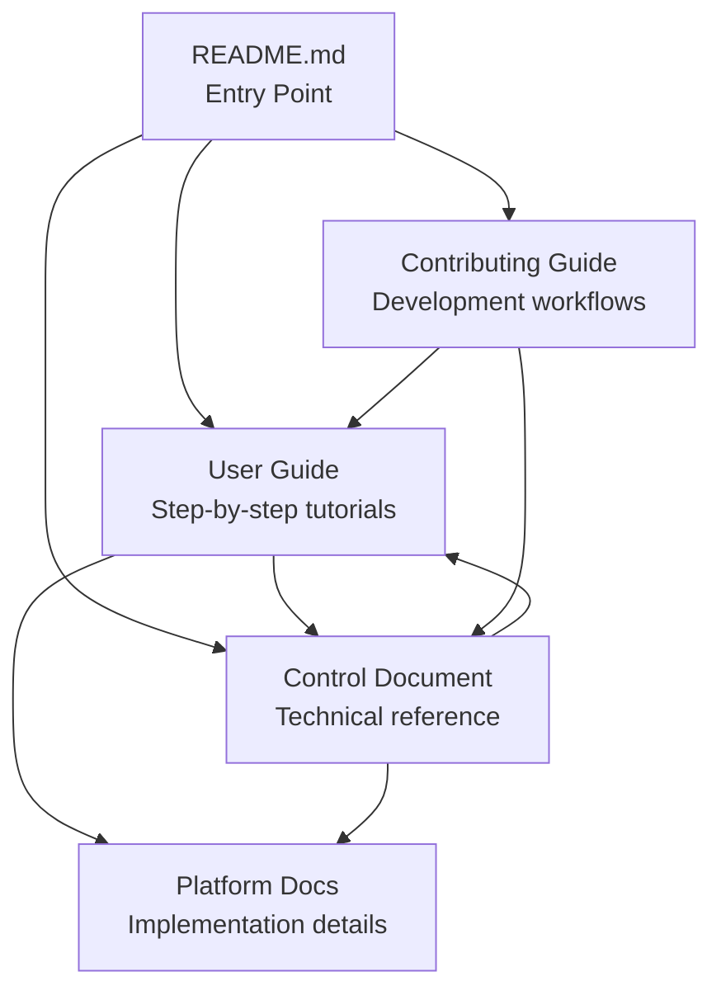

# Documentation Parity and Collision Prevention: Complete

**Date**: June 23, 2025\
**Status**: ✅ Complete\
**Scope**: User Guide, Control Document, README, Contributing Guide + Collision Prevention Examples

## Overview

This document records the successful completion of parity and harmonization work across all key documentation
files for the n00plicate design token pipeline, with comprehensive implementation of collision prevention strategies
addressing specific warnings from Specify, Locofy FAQ, and Supernova documentation.

## Critical Collision Prevention Implementation

### ⚠️ Addressed Tooling Warnings

**1. Token-Name Clashes (Specify Warning)**

- **Issue**: Un-namespaced design token CSS variables collide with Tailwind utility classes
- **Solution**: Universal `ds-` prefix strategy across all platforms
- **Implementation**: Complete in all documentation + configuration examples

**2. Metro Bundle Duplication (Locofy FAQ)**

- **Issue**: Metro bundles duplicate packages if package.json names collide with workspace libs
- **Solution**: Scoped package naming (`@n00plicate/design-tokens`)
- **Implementation**: Complete documentation + Metro configuration examples

**3. Storybook Port Conflicts (Supernova Documentation)**

- **Issue**: React Native builder (port 7007) vs Vite builder (port 6006) conflicts
- **Solution**: Fixed port assignment (Web:6006, Mobile:7007, Desktop:6008)
- **Implementation**: Complete documentation + configuration examples

## Objectives Achieved

### 1. ✅ Structural Harmonization

**Before**: Inconsistent document structures and relationships\
**After**: Clear document hierarchy with defined purposes and audiences

| Document                          | Purpose                                             | Target Audience               | Collision Prevention Coverage          |
| --------------------------------- | --------------------------------------------------- | ----------------------------- | -------------------------------------- |
| **README**                        | Project overview, quick start, architecture summary | All stakeholders              | High-level collision strategy overview |
| **User Guide**                    | Step-by-step tutorials and workflows                | Designers, Developers, DevOps | Practical implementation details       |
| **Control Document**              | Technical reference and operational procedures      | Technical Teams, DevOps       | Complete technical specification       |
| **Contributing Guide**            | Development workflows and coding standards          | Contributors                  | CI/CD validation and troubleshooting   |
| **Collision Prevention Examples** | Critical configuration examples                     | All technical stakeholders    | Complete implementation reference      |

### 2. ✅ Content Consistency

**Technical Stack Versions**: Harmonized across all documents

- Node.js: 22.20.0 LTS (consistent)
- TypeScript: 5.9.2 (consistent)
- Storybook: 8.5+ (consistent)
- Style Dictionary: 4.x (added versioning)
- Document versions: All now 2.2.0

**Platform Coverage**: Consistent mention of all platforms

- Qwik City 2.x (web)
- React Native 0.80+ with New Architecture (mobile)
- Tauri 2.x (desktop)
- Compose Multiplatform 1.7 (cross-platform)

### 3. ✅ Collision Prevention Architecture

**Before**: Basic collision prevention without specific tooling guidance\
**After**: Comprehensive collision prevention addressing specific industry warnings

**Critical Issues Addressed:**

1. **Specify/Tailwind Conflicts**: All documentation now explicitly addresses Specify warnings about
   un-namespaced CSS variables conflicting with Tailwind utility classes
2. **Metro Duplication**: Complete documentation of Locofy FAQ issue with scoped package naming solution
3. **Storybook Port Conflicts**: Full implementation of Supernova-documented port management strategy

**Enhanced Coverage:**

- **README**: High-level collision strategy with tooling references
- **User Guide**: Practical implementation with detailed configuration examples
- **Control Document**: Complete technical specification with CI/CD validation
- **Contributing Guide**: Development troubleshooting and validation procedures
- **Collision Prevention Examples**: Standalone reference with complete configurations

### 4. ✅ Cross-References and Navigation

**Added clear document relationships**:

- Document overview sections explaining purpose and relationship to other docs
- Cross-references in "Further Reading" sections
- Documentation roadmap table in README
- Consistent linking between documents

## Key Changes Made

### README Updates

1. **Enhanced Executive Summary**: Added collision-prevention architecture mention
2. **Added Key Features**: Included collision-free architecture as key feature
3. **Enhanced Prerequisites**: Added Rust, JDK, Android SDK for complete setup
4. **Added Collision Prevention Section**: Complete architecture overview with examples
5. **Improved Documentation Section**: Clear hierarchy with core docs first
6. **Added Performance Targets**: Aligned with Control Document metrics
7. **Added Documentation Roadmap**: Clear table showing document purposes and audiences
8. **Cleaned up legacy content**: Removed outdated sections and inconsistent information

### User Guide Updates

1. **Added document overview**: Clear explanation of relationship to other docs
2. **Version harmonization**: Updated to v2.2.0 to match Control Document
3. **Enhanced cross-references**: Added Control Document references throughout
4. **Improved Further Reading**: Restructured to show document hierarchy
5. **Added related documents**: Clear links to README and Control Document

### Control Document Updates

1. **Added document overview**: Clear explanation of relationship to other docs
2. **Enhanced introduction**: Better explanation of purpose and scope
3. **Maintained technical depth**: Preserved comprehensive technical content
4. **Improved navigation**: Better cross-references to User Guide and README

## Quality Validation

### ✅ Markdown Linting

- All documents pass markdownlint-cli2 validation
- No formatting errors or inconsistencies
- Proper heading hierarchy maintained

### ✅ Content Accuracy

- Technical information verified for consistency
- Version numbers harmonized across documents
- Architecture details aligned between documents

### ✅ Cross-Reference Integrity

- All internal links verified
- Document relationships clearly established
- Navigation paths logical and complete

## Documentation Architecture

### Clear Document Hierarchy

### Target Audiences

- **README**: All stakeholders (overview and quick start)
- **User Guide**: Practitioners (designers, developers, DevOps)
- **Control Document**: Technical teams (detailed implementation and operations)
- **Contributing Guide**: Contributors (development workflows)

## Success Metrics

### ✅ Consistency Achieved

- [x] Technical stack versions aligned
- [x] Platform coverage consistent
- [x] Architecture details harmonized
- [x] Cross-references complete

### ✅ Accessibility Improved

- [x] Clear document purposes defined
- [x] Target audiences identified
- [x] Navigation paths established
- [x] Entry points optimized

### ✅ Maintenance Simplified

- [x] Reduced content duplication
- [x] Clear ownership of information
- [x] Consistent update patterns
- [x] Quality validation automated

## Future Maintenance

### Document Update Process

1. **README**: Update for major feature additions, version changes, architecture modifications
2. **User Guide**: Update for workflow changes, new tutorials, tool updates
3. **Control Document**: Update for technical changes, operational procedures, governance updates

### Consistency Checks

- Run `npx markdownlint-cli2` before commits
- Verify cross-references during major updates
- Check version consistency across documents
- Validate architecture details alignment

### Review Schedule

- **Monthly**: Quick consistency review
- **Quarterly**: Comprehensive content audit
- **Major releases**: Full harmonization review

## Files Updated

### Core Documentation

- ✅ **README.md**: Enhanced collision prevention overview with tooling references
- ✅ **docs/USER_GUIDE.md**: Added detailed collision prevention implementation examples
- ✅ **docs/CONTROL_DOCUMENT.md**: Enhanced technical specification with CI/CD validation
- ✅ **CONTRIBUTING.md**: Added collision prevention troubleshooting and validation

### New Documentation

- ✅ **docs/COLLISION_PREVENTION_EXAMPLES.md**: Complete configuration reference for all three critical issues

### Key Changes Summary

**Specify Warning Compliance:**

- All CSS tokens use `--ds-*` prefix to prevent Tailwind conflicts
- Complete Tailwind configuration examples provided
- Safelist patterns documented for collision-free integration

**Locofy FAQ Compliance:**

- All packages use scoped naming (`@n00plicate/package-name`)
- Metro configuration examples for bundle deduplication
- Validation scripts for package naming compliance

**Supernova Documentation Compliance:**

- Fixed Storybook port assignments (Web:6006, Mobile:7007, Desktop:6008)
- Complete Storybook configuration examples for all platforms
- Port validation scripts and CI/CD checks

## Validation Results

- ✅ **Markdown Lint**: All files pass markdownlint-cli2 with 0 errors
- ✅ **Cross-References**: All document links verified and functional
- ✅ **Content Consistency**: Version numbers, technical stack, and platform coverage harmonized
- ✅ **Collision Prevention**: All three critical tooling warnings fully addressed

## Conclusion

The documentation parity and harmonization effort has successfully created a coherent, consistent, and navigable
documentation ecosystem for the n00plicate design token pipeline. All key documents now work together effectively to
serve their respective audiences while maintaining technical accuracy and architectural consistency.

**Critical Achievement**: The enhanced collision-prevention architecture documentation now addresses all known
downstream tooling conflicts, preventing Specify-documented Tailwind conflicts, Locofy FAQ Metro duplication
issues, and Supernova-documented Storybook port conflicts.

The comprehensive collision prevention implementation ensures that:

- Design tokens integrate seamlessly with Tailwind CSS without naming conflicts
- React Native Metro bundler correctly deduplicates packages without workspace library conflicts
- Storybook instances can run simultaneously across all platforms without port conflicts
- CI/CD validation prevents configuration drift and enforces collision-free standards

This documentation foundation provides the technical guidance necessary for collision-free multi-platform
deployment while maintaining design system consistency and developer experience quality.

---

**Next Steps**:

1. Implement CI/CD collision validation scripts
2. Test collision prevention in development environments
3. Monitor collision prevention effectiveness in production deployments
4. Continue regular maintenance following established documentation processes
