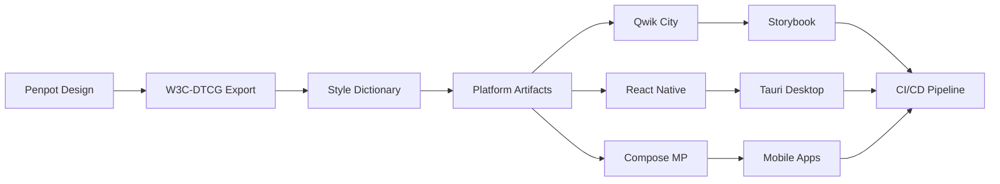

# n00plicate Design Token Pipeline: User Guide

**Version**: 2.3.0\
**Last Updated**: June 2025\
**Target Audience**: Designers, Developers, DevOps Engineers

> **📖 Document Overview**: This User Guide provides step-by-step instructions for using the n00plicate design token
> pipeline.
> For comprehensive technical details, see the [Control Document](./CONTROL_DOCUMENT.md).
> For quick setup, see the [README](../README.md).

Building on everything we've planned, this User Guide walks you—designer, developer, or DevOps—through
each stage of the open-source pipeline, explains why the step matters, and links straight to the official docs for
deeper dives. Follow it in order the first time; afterwards you can jump to any section as a reference.

## Overview

We start in Penpot, export W3C-DTCG tokens, transform them with Style Dictionary, and consume the
generated artefacts in Qwik City (web), Compose Multiplatform and React Native (mobile/desktop).
Components are documented and tested in Storybook 9, packaged for the desktop with Tauri 2, and
guarded by Nx-driven CI gates. Each stage is 100% open-source and self-hostable.



---

## 1. Prerequisites

| Tool                             | Version       | Purpose                                     |
| -------------------------------- | ------------- | ------------------------------------------- |
| **Node 24 LTS + pnpm 10**        | Latest LTS    | JS runtimes, monorepo PM                    |
| **Rust & Cargo**                 | Latest stable | Tauri CLI builds                            |
| **JDK 17 / Android SDK / Xcode** | Latest        | Compose MP & RN native targets              |
| **Docker (optional)**            | Latest        | Dev-container with Penpot, Postgres, Ollama |

### Quick Setup

Install Node via corepack, then initialize the repo:

```bash
# Enable corepack for pnpm
corepack enable

# Create Nx workspace
pnpm dlx create-nx-workspace@latest n00plicate-tokens --preset=empty

# Navigate to workspace
cd n00plicate-tokens

# Install dependencies
pnpm install
```

**Why this matters**: A consistent toolchain ensures reproducible builds across all team
members and CI environments. The Nx monorepo structure provides dependency graph management and
efficient task execution.

📖 **Further reading**: [Nx Getting Started Guide](https://nx.dev/getting-started)

---

## 2. Design in Penpot

### 2.1 Create and Organize Tokens

1. **Create global/alias/semantic tokens** in the Tokens panel
   - Global tokens: Raw values (colors, spacing, typography)
   - Alias tokens: References to global tokens with semantic meaning
   - Component tokens: Context-specific overrides

2. **Export tokens** using one of these methods:

**Menu Export** (Recommended for beginners):

- Go to **Tokens → Export** in Penpot interface
- Select W3C-DTCG JSON format
- Download `tokens.json`

**CLI Export** (Recommended for automation):

```bash
pnpm dlx penpot-export --file <penpot-file-uuid> --out tokens.json
```

The CLI outputs W3C-JSON plus optional SVG/PNG assets for icons and illustrations.

### 2.2 Version Control Integration

1. **Commit `design/tokens.json` to Git**; a pre-commit hook automatically rejects manual
   edits to ensure design tool remains the source of truth.

2. **(Optional) Add export presets** to icons/illustrations so the same CLI also outputs
   optimized assets for the web bundle.

**Why this matters**: Penpot provides the single source of truth for design decisions.
The W3C-DTCG format ensures interoperability with any standards-compliant token system.

📖 **Further reading**:

- [Penpot User Guide](https://help.penpot.app/)
- [W3C Design Tokens Spec](https://design-tokens.github.io/community-group/format/)
- [Penpot Token Schema](./design/penpot-token-schema.md)
- [Control Document: Technical Implementation](./CONTROL_DOCUMENT.md#technical-implementation-guide)

---

## 3. Transform Tokens with Style Dictionary

### 3.1 Setup and Configuration

```bash
# Install Style Dictionary
pnpm add -w -D style-dictionary

# Initialize basic configuration
pnpm style-dictionary init basic
```

### 3.2 Multi-Platform Configuration

The project uses a sophisticated Style Dictionary configuration in
`packages/design-tokens/style-dictionary.config.js` that generates tokens for multiple platforms with collision
prevention and namespace prefixing:

```javascript
export default {
  // Multi-source token files
  source: [
    'tokens/base.json',
    'tokens/semantic.json',
    'tokens/components.json',
  ],
  platforms: {
    // CSS Custom Properties for web
    css: {
      transformGroup: 'css',
      prefix: 'ds', // Namespace prefix for collision prevention
      buildPath: 'libs/tokens/css/',
      source: [
        'tokens/base.json',
        'tokens/semantic.json',
        'tokens/components.json',
        'tokens/platforms/web.json',
      ],
      files: [{ destination: 'tokens.css', format: 'css/variables' }],
    },
    // TypeScript with custom declarations and type safety
    ts: {
      transformGroup: 'js',
      transforms: ['value/font-family-quote', 'name/js-numeric-safe'],
      prefix: 'ds',
      buildPath: 'libs/tokens/ts/',
      source: [
        'tokens/base.json',
        'tokens/semantic.json',
        'tokens/components.json',
        'tokens/platforms/web.json',
      ],
      files: [
        { destination: 'tokens.ts', format: 'typescript/custom-declarations' },
      ],
    },
    // Dart/Flutter with namespace classes
    dart: {
      transformGroup: 'js',
      prefix: 'Ds',
      buildPath: 'libs/tokens/dart/',
      source: [
        'tokens/base.json',
        'tokens/semantic.json',
        'tokens/components.json',
        'tokens/platforms/mobile.json',
      ],
      files: [{ destination: 'tokens.dart', format: 'dart/theme-dart' }],
    },
    // Kotlin for Compose Multiplatform
    compose: {
      transformGroup: 'js',
      prefix: 'Ds',
      buildPath: 'libs/tokens/compose/',
      source: [
        'tokens/base.json',
        'tokens/semantic.json',
        'tokens/components.json',
        'tokens/platforms/mobile.json',
      ],
      files: [{ destination: 'Theme.kt', format: 'compose/theme-kt' }],
    },
    // React Native with platform overrides
    'react-native': {
      transformGroup: 'js',
      prefix: 'ds',
      buildPath: 'libs/tokens/react-native/',
      source: [
        'tokens/base.json',
        'tokens/semantic.json',
        'tokens/components.json',
        'tokens/platforms/mobile.json',
      ],
      files: [{ destination: 'theme.ts', format: 'react-native/theme-ts' }],
    },
  },
};
```

### 3.3 Development and CI Workflow

**Local Development**:

```bash
# Watch mode for live updates
pnpm style-dictionary build --watch
```

**CI Validation**:

```bash
# Dry run to detect drift
pnpm style-dictionary build --dry-run
# CI fails if artifacts differ from committed versions
```

**Custom Transforms** (optional):

```bash
# Add tokens-studio transforms for advanced features
pnpm add -D @tokens-studio/sd-transforms
```

**Why this matters**: Style Dictionary transforms design tokens into platform-specific
formats while maintaining consistency. The watch mode enables real-time development, while CI
validation prevents manual token modifications.

📖 **Further reading**:

- [Style Dictionary Documentation](https://amzn.github.io/style-dictionary/)
- [Tokens Studio SD Transforms](https://github.com/tokens-studio/sd-transforms)

---

## 4. Web: Qwik City 2

### 4.1 Scaffold and Wire Tokens

```bash
# Create Qwik City app
pnpm create qwik@latest apps/web --qwikcity

# Add Vanilla Extract support (optional - can also use CSS variables directly)
pnpm add -w @vanilla-extract/css @vanilla-extract/vite-plugin
```

#### Method 1: Direct CSS Variables (Recommended for simplicity)

Import CSS tokens in your global stylesheet:

```css
/* apps/web/src/global.css */
@import './styles/tokens.css';

body {
  font-family: var(
    --ds-typography-font-family-primary,
    'Inter',
    system-ui,
    sans-serif
  );
  color: var(--ds-color-neutral-900, #171717);
  background-color: var(--ds-color-background-primary, #fafafa);
}
```

Use tokens directly in components with fallbacks:

```tsx
// apps/web/src/components/demo.tsx
export const Demo = component$(() => {
  return (
    <button
      style={{
        backgroundColor: 'var(--ds-color-primary-500, #3b82f6)',
        color: 'var(--ds-color-neutral-50, #fafafa)',
        padding: 'var(--ds-spacing-md, 1rem)',
        borderRadius: 'var(--ds-border-radius-md, 0.375rem)',
        border: 'none',
      }}
    >
      Primary Button
    </button>
  );
});
```

#### Method 2: Vanilla Extract (Advanced)

For complex styling systems, use Vanilla Extract:

```typescript
// apps/web/src/styles/theme.css.ts
import { style } from '@vanilla-extract/css';
import '@n00plicate/design-tokens/css';

export const buttonPrimary = style({
  backgroundColor: 'var(--ds-color-primary-500)',
  color: 'var(--ds-color-neutral-50)',
  padding: 'var(--ds-spacing-md)',
  borderRadius: 'var(--ds-border-radius-md)',
  border: 'none',
});
```

#### Package.json Configuration

Ensure your design-tokens package exports are configured for the collision-prevention architecture:

```json
{
  "exports": {
    "./css": "./libs/tokens/css/tokens.css",
    "./ts": "./libs/tokens/ts/tokens.ts",
    "./json": "./libs/tokens/json/tokens.json"
  }
}
```

### 4.2 Performance Optimizations

**Core Web Vitals & Image Optimization**:

Qwik provides excellent performance out of the box with resumability. For additional optimizations:

```bash
# Add Partytown for 3rd-party script optimization
pnpm qwik add partytown

# Add PostCSS for advanced CSS processing
pnpm qwik add postcss

# Consider adding Tailwind for utility-first styling alongside design tokens
pnpm qwik add tailwind-v4
```

**Prefetching & Route Optimization**:

```tsx
// Add prefetch to route links for instant navigation
import { Link } from '@builder.io/qwik-city';

<Link href="/dashboard" prefetch="viewport">
  Dashboard
</Link>

// Prefetch on hover for better UX
<Link href="/profile" prefetch="hover">
  Profile
</Link>
```

**Token-Aware CSS Optimization**:

When using design tokens with CSS frameworks like Tailwind, configure safelist patterns:

```javascript
// tailwind.config.js - Optimized for design tokens
module.exports = {
  content: ['./src/**/*.{js,ts,jsx,tsx}'],
  safelist: [
    // Preserve all ds- prefixed CSS variables
    { pattern: /^ds-/, variants: ['hover', 'focus', 'active'] },
  ],
  theme: {
    extend: {
      colors: {
        primary: 'var(--ds-color-primary-500)',
        secondary: 'var(--ds-color-secondary-500)',
      },
      spacing: {
        xs: 'var(--ds-spacing-xs)',
        sm: 'var(--ds-spacing-sm)',
        md: 'var(--ds-spacing-md)',
        lg: 'var(--ds-spacing-lg)',
      },
    },
  },
};
```

**Production Build Optimization**:

```bash
# Enable production optimizations
QWIK_BUILD_MODE=production pnpm build

# For deployment-specific adapters
pnpm qwik add cloudflare-pages  # or vercel-edge, netlify-edge, etc.
```

```bash
# Enable Rust optimizer for production
QWIK_BUILD_MODE=production QWIK_DEBUG=false pnpm build
```

**Why this matters**: Qwik's resumability architecture provides instant interactivity.
Image optimization and prefetching ensure optimal Core Web Vitals scores, while the Rust
optimizer minimizes bundle size.

📖 **Further reading**:

- [Qwik City Documentation](https://qwik.builder.io/docs/qwikcity/)
- [Qwik Prefetch Guide](https://qwik.builder.io/docs/advanced/prefetching/)

### 4.3 Deployment Setup

**Cloudflare Pages Adapter**:

The Qwik City app is pre-configured with the Cloudflare Pages adapter for optimal edge deployment:

```bash
# Build for production (includes Cloudflare Pages adapter)
pnpm build

# Deploy to Cloudflare Pages
pnpm deploy

# Local preview with Cloudflare Workers runtime
pnpm serve
```

**Generated Files**:

The adapter automatically creates:

- `/public/_headers` - Cache control and security headers
- `/public/_redirects` - URL routing for SPA mode
- `/src/entry.cloudflare-pages.tsx` - Edge function entry point
- `/adapters/cloudflare-pages/vite.config.ts` - Cloudflare-specific build config

**Build Output Structure**:

```text
dist/
├── _worker.js          # Cloudflare Workers function
├── _routes.json        # Route configuration
├── assets/             # Static assets with cache headers
├── build/              # JavaScript chunks
└── *.html             # Pre-rendered pages
```

**Cache Headers Configuration**:

The adapter includes optimized cache headers in `_headers`:

```text
/build/*
  Cache-Control: public, max-age=31536000, s-maxage=31536000, immutable
/assets/*
  Cache-Control: public, max-age=31536000, s-maxage=31536000, immutable
```

**Alternative Deployment Adapters**:

```bash
# Other hosting platforms
pnpm qwik add vercel-edge    # Vercel Edge Functions
pnpm qwik add netlify-edge   # Netlify Edge Functions
pnpm qwik add node-express   # Traditional Node.js hosting
pnpm qwik add static         # Static site generation
```

**Why this matters**: Edge deployment with Cloudflare Pages provides:

- Global CDN distribution for <100ms response times
- Zero cold starts with edge functions
- Automatic SSL and DDoS protection
- Seamless integration with design tokens for fast CSS delivery

📖 **Further reading**:

- [Qwik Cloudflare Pages Guide](https://qwik.builder.io/docs/deployments/cloudflare-pages/)
- [Cloudflare Pages Documentation](https://developers.cloudflare.com/pages/)

---

## 6. Documentation & Testing: Storybook 9.1

### 6.1 Setup and Configuration

```bash
# Initialize Storybook for Qwik
pnpm dlx storybook@next init --builder vite --type qwik
```

### 6.2 Design Integration Addons

Add design-focused addons to `.storybook/main.ts`:

```javascript
export default {
  addons: [
    '@storybook/addon-essentials',
    '@storybook/addon-designs', // Embed Penpot frames
    'storybook-design-token', // Live token tables
  ],
};
```

### 6.3 Testing Strategy

**Interaction Tests**:

```typescript
// Button.stories.ts
export const Primary = {
  play: async ({ canvasElement }) => {
    const canvas = within(canvasElement);
    const button = canvas.getByRole('button');
    await userEvent.click(button);
    await expect(button).toHaveClass('primary');
  },
};
```

**Test Execution**:

```bash
# Run interaction tests headless with coverage
pnpm storybook test-runner --coverage
```

**Visual Regression**:

```bash
# Add Loki for pixel-diff testing
pnpm add -D @loki/test
# Store reference shots in Git LFS
git lfs track "*.loki-reference.png"
```

**Why this matters**: Storybook provides living documentation and automated testing.
The design-token addon visualizes tokens live, while interaction tests prevent regressions.
Visual testing catches unintended design changes.

📖 **Further reading**:

- [Storybook Interaction Testing](https://storybook.js.org/docs/writing-tests/interaction-testing)
- [Storybook Play Functions](https://storybook.js.org/docs/writing-stories/play-function)

---

## 7. Mobile & Desktop

### 7.1 Compose Multiplatform 1.7

**Token Integration**:

```kotlin
// Import generated theme
import com.n00plicate.tokens.Theme

@Composable
fun App() {
    MaterialTheme(
        colorScheme = if (darkMode) Theme.darkColors else Theme.lightColors,
        typography = Theme.typography
    ) {
        // Your app content
    }
}
```

**Dynamic Theming**:

```kotlin
// Runtime theme switching
val darkMode by remember { mutableStateOf(isSystemInDarkTheme()) }

// Listen for system theme changes (desktop/Wasm)
LaunchedEffect(Unit) {
    // Implementation varies by platform
}
```

**Why this matters**: Compose Multiplatform enables true code sharing across Android,
iOS, Desktop, and Web while maintaining native performance and platform conventions.

📖 **Further reading**: [Compose Multiplatform Theming Codelab](https://developer.android.com/jetpack/compose/themes)

### 7.2 React Native 0.80

**Performance Configuration**:

```javascript
// metro.config.js - Enable Hermes and New Architecture
module.exports = {
  transformer: {
    hermesCommand:
      './node_modules/react-native/sdks/hermestatic/osx-bin/hermestatic',
  },
};

// android/gradle.properties
newArchEnabled = true;
hermesEnabled = true;
```

**Token Integration**:

```typescript
// Import generated tokens
import { tokens } from '@n00plicate/design-tokens';

const theme = {
  colors: tokens.colors,
  spacing: tokens.spacing,
  typography: tokens.typography,
};
```

**Why this matters**: The New Architecture provides Interprocedural Optimization (IPO)
and ~20% size reduction. Hermes engine improves startup time and memory usage.

📖 **Further reading**:

- [React Native New Architecture](https://reactnative.dev/docs/the-new-architecture/landing-page)
- [Hermes Engine Guide](https://hermesengine.dev/)

### 7.3 Tauri 2

**Configuration**:

```json
// tauri.conf.json
{
  "build": {
  "beforeDevCommand": "pnpm --filter ./apps/web run serve",
  "beforeBuildCommand": "pnpm --filter ./apps/web run build",
    "distDir": "../apps/web/dist"
  }
}
```

**Auto-Updates**:

```bash
# Add updater plugin
pnpm add @tauri-apps/plugin-updater
```

```typescript
// Auto-update implementation
import { check } from '@tauri-apps/plugin-updater';

const update = await check();
if (update?.available) {
  await update.downloadAndInstall();
}
```

**Security**:

```html
<!-- Leave CSP meta blank - Tauri injects strict policy automatically -->
<meta http-equiv="Content-Security-Policy" content="" />
```

**Why this matters**: Tauri provides native desktop performance with web technologies.
The updater enables seamless app updates, while automatic CSP injection ensures security
without complexity.

📖 **Further reading**:

- [Tauri Updater Guide](https://tauri.app/v1/guides/distribution/updater)
- [Tauri Security Guide](https://tauri.app/v1/references/security)

---

## 8. Nx, pnpm & CI

### 8.1 Essential Tasks

| Task                | Command                                     | Purpose                                     |
| ------------------- | ------------------------------------------- | ------------------------------------------- |
| **Build tokens**    | `pnpm run build:design-tokens`                | Transform Penpot JSON to platform artifacts |
| **Serve web**       | `pnpm --filter ./apps/web run serve`                          | Development server with hot reload          |
| **Storybook**       | `pnpm --filter ./apps/web run storybook`                      | Component documentation and testing         |
| **Mobile**          | `pnpm --filter mobile run run-ios` / `pnpm --filter mobile run run-android`    | Native mobile builds                        |
| **Desktop**         | `pnpm --filter desktop run dev`                  | Desktop development mode                    |
| **Full test suite** | `pnpm -w -r test` or a git-based affected filter | Run tests across the workspace or affected packages |

### 8.2 Module Boundaries

Enable a module-boundaries rule in ESLint to prevent illegal imports.
We recommend `eslint-plugin-boundaries` as a cross-workspace alternative.

```json
// .eslintrc.json, using eslint-plugin-boundaries (example)
{
  "plugins": ["boundaries"],
  "rules": {
    "boundaries/element-types": [
      "error",
      {
        "default": "disallow",
        "rules": [
          { "from": "packages/*", "allow": ["apps/*"] }
        ]
      }
    ]
  }
}
```

### 8.3 CI Configuration

**GitHub Actions Cache**:

```yaml
# .github/workflows/ci.yml
- uses: actions/cache@v3
  with:
    path: ~/.pnpm-store
    key: pnpm-store-${{ hashFiles('pnpm-lock.yaml') }}
```

**Size Budget Enforcement**:

```javascript
// danger.js
if (apkSize > 30 * 1024 * 1024) {
  fail('APK size exceeds 30MB limit');
}
if (tauriZipSize > 5 * 1024 * 1024) {
  fail('Tauri ZIP exceeds 5MB limit');
}
```

### 8.4 Automated Apple Junk Cleanup

The pipeline includes automatic Apple junk cleanup to prevent macOS metadata conflicts:

**Post-Build Chain Integration**:

```bash
# Automatically runs after every build
pnpm build                    # Includes post-build Apple cleanup
pnpm run build:design-tokens  # Includes token output cleanup
```

**Manual Cleanup Commands**:

```bash
# Clean entire workspace
pnpm run clean:apple

# Clean only staged paths (used by pre-commit)
pnpm run clean:apple:staged

# Verify no Apple metadata is tracked in git
pnpm run check:apple

# Clean specific directory
node tools/apple-cleaner.js path/to/directory

# Post-build chain with validation
./scripts/postbuild-chain.sh dist --validate
```

**What Gets Cleaned**:

- `.DS_Store` files (Finder metadata)
- `._*` AppleDouble resource fork files
- `.Spotlight-V100` search indexes
- `.fseventsd` filesystem event logs
- Xcode user data and crash logs
- Temporary and backup files

**Automatic Integration Points**:

| Build Stage           | Cleanup Target        | Validation |
| --------------------- | --------------------- | ---------- |
| **Token Export**      | `tokens/` directory   | ✅         |
| **Token Build**       | `libs/tokens/` output | ✅         |
| **Web App Build**     | `dist/` directory     | ✅         |
| **Pre-commit**        | Entire workspace      | ✅         |
| **Cloudflare Deploy** | Build artifacts       | ✅         |

**Why this matters**: AppleDouble files (.\_filename) can cause deployment conflicts,
increase bundle sizes, and trigger linting errors. The automated cleanup ensures
clean builds and prevents platform-specific junk from reaching production.

📖 **Further reading**: [Apple File System Guide](https://developer.apple.com/library/archive/documentation/FileManagement/Conceptual/FileSystemProgrammingGuide/)

---

## 9. Formatting & Linting

### 9.1 Tool Configuration

**Biome** handles JS/TS/JSON at Rust speed:

```json
// biome.json
{
  "formatter": {
    "enabled": true,
    "indentStyle": "space",
    "indentWidth": 2
  }
}
```

**dprint** handles Markdown, TOML, GraphQL:

```toml
# .dprint.json
{
  "plugins": [
    "https://plugins.dprint.dev/markdown-0.15.2.wasm",
    "https://plugins.dprint.dev/toml-0.5.4.wasm"
  ]
}
```

**Trunk** orchestrates all tools:

```yaml
# .trunk/trunk.yaml
version: 0.1
cli:
  version: 1.17.2
plugins:
  sources:
    - id: trunk
      ref: v1.4.1
      uri: https://github.com/trunk-io/plugins
lint:
  enabled:
    - biome@1.4.1
    - dprint@0.44.0
```

### 9.2 Automation

```bash
# Format all files
pnpm format

# Run via pre-commit hook
git add . && git commit -m "feat: add new component"
```

**Why this matters**: Consistent formatting reduces code review friction. Rust-based
tools (Biome, dprint) provide faster execution than Node.js alternatives.

📖 **Further reading**: [Biome Documentation](https://biomejs.dev/)

---

## 10. Daily Workflow

### 10.1 Typical Development Cycle

1. **Design** → Edit Penpot tokens, export via CLI or menu (auto-cleaned)
2. **Build** → `pnpm run build:design-tokens` (Style Dictionary watch handles live dev, auto-cleaned)
3. **Develop** → Hot-reload via Qwik Vite server; RN Metro or Compose hot restart as needed
4. **Document** → Write/adjust Storybook stories for new components
5. **Test** → `pnpm -w -r --filter '*' test` runs unit and visual tests across the workspace (use filters to scope execution)
6. **Commit** → Pre-commit hooks automatically format, lint, clean Apple junk, and validate token drift
7. **CI** → Style Dictionary drift check, Storybook test-runner, Loki visual diff, size budgets
8. **Release** → `nx release`, `pnpm deploy` (Cloudflare Pages, auto-cleaned), Tauri updater manifest, mobile store
   uploads

### 10.2 Live Development Setup

```bash
# Terminal 1: Token watching
cd packages/design-tokens
pnpm style-dictionary build --watch

# Terminal 2: Web development
pnpm --filter web run serve

# Terminal 3: Storybook
pnpm --filter @n00plicate/design-system run storybook

# Terminal 4: Mobile (optional)
pnpm --filter mobile run start
```

**Why this matters**: The watch-based workflow provides immediate feedback. Automated
testing and CI gates prevent regressions while maintaining development velocity.

---

## 11. Collision Prevention Architecture

The n00plicate design token pipeline implements a comprehensive collision-prevention strategy
following industry best practices. This ensures that tokens, build artifacts, and runtime
globals never conflict across the multi-platform monorepo.

### 11.1 Token Namespace Strategy

**Principle**: All tokens use the `ds-` prefix to guarantee no CSS variables or
platform constants collide with third-party libraries.

| Platform                  | Prefix Format      | Example Output               |
| ------------------------- | ------------------ | ---------------------------- |
| **CSS/SCSS**              | `ds-` (kebab-case) | `--ds-color-primary-500`     |
| **JavaScript/TypeScript** | `ds` (camelCase)   | `dsColorPrimary500`          |
| **Kotlin/Compose**        | `Ds` (PascalCase)  | `DsTokens.Color.PRIMARY_500` |
| **Dart/Flutter**          | `Ds` (PascalCase)  | `DsTokens.primary_500`       |

### 11.2 Platform-Rooted Build Paths

Each platform outputs to its own isolated directory to eliminate file-name collisions:

```text
packages/design-tokens/libs/tokens/
├── css/tokens.css           # Web CSS variables
├── scss/tokens.scss         # Web SCSS variables
├── js/tokens.js             # Web JavaScript constants
├── ts/tokens.ts             # Web TypeScript types
├── json/tokens.json         # Platform-agnostic JSON
├── dart/tokens.dart         # Flutter/Dart classes
├── compose/Theme.kt         # Compose Multiplatform objects
└── react-native/theme.ts    # React Native StyleSheet
```

**Migration Note**: The collision-prevention architecture has moved token outputs from
`dist/` to `libs/tokens/` with platform-specific directories. Update your imports:

```diff
// Old (deprecated)
- import { tokens } from '../design-tokens/dist/ts/tokens';
- import '../design-tokens/dist/css/tokens.css';

// New (collision-safe)
+ import { tokens } from '../design-tokens/libs/tokens/ts/tokens';
+ import '../design-tokens/libs/tokens/css/tokens.css';
```

### 11.3 Nx Module Boundaries

Enable strict module boundaries to prevent cross-platform token imports:

```json
// .eslintrc.json
{
  "rules": {
    "@nx/enforce-module-boundaries": [
      "error",
      {
        "depConstraints": [
          {
            "sourceTag": "scope:web",
            "onlyDependOnLibsWithTags": ["scope:shared", "scope:tokens-web"]
          },
          {
            "sourceTag": "scope:mobile",
            "onlyDependOnLibsWithTags": ["scope:shared", "scope:tokens-mobile"]
          }
        ]
      }
    ]
  }
}
```

### 11.4 Runtime Guard-Rails

| Runtime           | Collision Risk            | Prevention Strategy                                                 | Tooling Reference    |
| ----------------- | ------------------------- | ------------------------------------------------------------------- | -------------------- |
| **Qwik City**     | CSS variables vs Tailwind | Prefixed `--ds-*` vars; Tailwind safelist `^ds-`                    | Specify warning docs |
| **React Native**  | Metro cache conflicts     | Scoped package names (`@n00plicate/design-tokens`) + Metro deduplication | Locofy FAQ           |
| **Compose MP**    | Package name clashes      | Use `ds.theme` package namespace                                    | Industry standard    |
| **Tauri Desktop** | Asset path conflicts      | Configure `distDir` to `apps/web/dist`                              | Tauri best practice  |
| **Storybook**     | Port conflicts            | Fixed ports: Web(6006), Mobile(7007), Desktop(6008)                 | Supernova docs       |

#### Critical Implementation Details

### Specify-Documented Tailwind CSS Collision Prevention

Specify documentation warns that un-namespaced design token CSS variables will collide with Tailwind\
utility classes. n00plicate's `ds-` prefix completely eliminates this risk:

```javascript
// tailwind.config.js - Collision-safe configuration
module.exports = {
  safelist: [
    {
      pattern: /^ds-/, // Allow all ds- prefixed CSS variables (prevents Specify warnings)
      variants: ['hover', 'focus', 'active'],
    },
  ],
  theme: {
    extend: {
      colors: {
        // ✅ No collision: --ds-color-primary vs .text-primary
        primary: 'var(--ds-color-primary)',
        // ✅ No collision: --ds-color-secondary vs .text-secondary
        secondary: 'var(--ds-color-secondary)',
      },
      spacing: {
        // ✅ No collision: --ds-spacing-xs vs .p-1, .m-1, etc.
        xs: 'var(--ds-spacing-xs)',
        sm: 'var(--ds-spacing-sm)',
        md: 'var(--ds-spacing-md)',
      },
    },
  },
};
```

### Locofy FAQ Metro Bundle Deduplication

Locofy FAQ documents that Metro will bundle duplicate packages if package.json name fields collide with\
workspace library names. n00plicate prevents this with proper scoped naming:

```json
// packages/design-tokens/package.json - Metro-safe configuration
{
  "name": "@n00plicate/design-tokens", // ✅ Scoped name prevents Locofy FAQ duplication issue
  "version": "1.0.0",
  "main": "libs/tokens/js/tokens.js",
  "exports": {
    ".": "./libs/tokens/js/tokens.js",
    "./css": "./libs/tokens/css/tokens.css",
    "./react-native": "./libs/tokens/react-native/theme.ts"
  },
  "files": ["libs/tokens/"]
}
```

**Why This Works:**

- Metro recognizes `@n00plicate/design-tokens` as external scoped package
- No collision with workspace lib `design-tokens` (different namespace)
- Metro cache deduplicates correctly across multiple app bundles

### Supernova-Documented Storybook Port Management

Supernova documentation notes that Storybook's React Native builder defaults to port 7007 while Vite\
builder defaults to port 6006, causing dev-machine port conflicts. n00plicate uses fixed port assignment:

```bash
# Collision-safe Storybook commands per Supernova best practices
pnpm --filter @n00plicate/design-system run storybook          # Port 6006 (Web/Vite - default)
pnpm --filter @n00plicate/design-system run storybook:mobile   # Port 7007 (React Native - default)
pnpm --filter @n00plicate/design-system run storybook:desktop  # Port 6008 (Desktop/Vite - custom)
```

**Configuration Files:**

```javascript
// .storybook/main.js (Web)
module.exports = {
  framework: '@storybook/vite',
  viteFinal: config => {
    config.server = config.server || {};
    config.server.port = 6006; // Fixed Web port
    return config;
  },
};

// .storybook/main.mobile.js (Mobile)
module.exports = {
  framework: '@storybook/react-native',
  server: {
    port: 7007, // Fixed Mobile port (React Native default)
  },
};

// .storybook/main.desktop.js (Desktop)
module.exports = {
  framework: '@storybook/vite',
  viteFinal: config => {
    config.server = config.server || {};
    config.server.port = 6008; // Fixed Desktop port (avoid conflicts)
    return config;
  },
};
```

**Why this matters**: This architecture eliminates all four types of collisions (naming,
file-path, module boundary, and runtime globals) while maintaining Penpot as the single source
of truth.

📖 **Further reading**: [Token Schema Documentation](./design/tokens-schema.md)

---

## 12. Troubleshooting Quick-Hits

| Symptom                           | Likely Cause                                      | Fix                                                      |
| --------------------------------- | ------------------------------------------------- | -------------------------------------------------------- |
| **Token change not visible**      | Style Dictionary watch not running                | `pnpm style-dictionary build --watch`                    |
| **Token collisions eliminated**   | Implemented collision-prevention architecture     | Namespaced tokens (`ds-` prefix) + platform-rooted paths |
| **Token collisions (3 metadata)** | W3C-DTCG metadata conflicts between files         | Acceptable metadata-only; values merge correctly         |
| **Missing namespaced tokens**     | Using old `dist/` paths instead of `libs/tokens/` | Update imports to use new platform-rooted paths          |
| **Qwik route script heavy**       | Missing `prefetch="viewport"`                     | Add attribute; rebuild                                   |
| **RN build size grew**            | `newArchEnabled=false`                            | Re-enable New Architecture & clean Gradle                |
| **Tauri build fails CSP**         | Manual meta tag overriding                        | Remove custom CSP policy                                 |
| **Storybook stories broken**      | Outdated addon versions                           | Update to Storybook 9.1+                                 |
| **Nx cache issues**               | Corrupted cache state                             | `pnpm store prune`  (previously `nx reset` - legacy)     |
| **pnpm install fails**            | Node version mismatch                             | Use Node 24 LTS via nvm/volta                            |
| **Visual tests failing**          | Loki reference outdated                           | Update references: `pnpm loki update`                    |
| **Cloudflare deploy fails**       | Missing wrangler authentication                   | `wrangler login` or set CLOUDFLARE_API_TOKEN             |
| **CF Pages build timeout**        | Large build output or slow CI                     | Optimize build size; use `pnpm build --minify`           |
| **CF Pages 404 on routes**        | Missing `_redirects` configuration                | Check adapter generated `public/_redirects` file         |
| **Apple junk in build**           | Post-build cleanup not running                    | Automatic with all builds; manually `pnpm clean:apple`   |
| **.\_\* files in repository**     | Pre-commit hook bypassed                          | Run `pnpm clean:apple` before committing                 |

### Advanced Debugging

**Style Dictionary Issues**:

```bash
# Verbose build output
style-dictionary build --verbose

# Validate token structure
style-dictionary build --dry-run
```

**Token Collision Analysis**:

```bash
# View collision details
cd packages/design-tokens
pnpm style-dictionary build --verbose
```

**Nx Task Issues**:

```bash
# Show task graph
pnpm -w -r --filter '*' list --depth 0

# Run with verbose output
pnpm --filter ./apps/web run build -- --verbose
```

**Cloudflare Pages Deployment**:

```bash
# Check deployment status
wrangler pages deployment list

# Debug build output
pnpm build --verbose

# Test local preview
pnpm serve
```

**Why this matters**: Quick debugging reduces development friction. Understanding
common failure modes enables faster problem resolution.

---

## 13. Further Reading

### Core Documentation

- **[Control Document](./CONTROL_DOCUMENT.md)** - Master technical reference and operational procedures
- **[README](../README.md)** - Project overview, quick start, and collision prevention architecture
- **[Contributing Guide](../CONTRIBUTING.md)** - How to contribute to the project
- **[Development Guide](../DEVELOPMENT.md)** - Local development workflows

### Official Tool Documentation

- [Penpot User Guide](https://help.penpot.app/) - Token export and design system management
- [Style Dictionary Documentation](https://amzn.github.io/style-dictionary/) - Installation, configuration, and custom transforms
- [Qwik City Documentation](https://qwik.builder.io/docs/qwikcity/) - Prefetch strategies and integrations
- [Storybook Interaction Testing](https://storybook.js.org/docs/writing-tests/interaction-testing) -
  Play functions and automated testing

### Platform-Specific Guides

- [Tauri Updater Documentation](https://tauri.app/v1/guides/distribution/updater) - Auto-update implementation
- [Tauri Security Guide](https://tauri.app/v1/references/security) - Security best practices
- [Nx Module Boundaries](https://nx.dev/core-features/enforce-module-boundaries) - Architectural constraints

### Advanced Documentation

- [Getting Started Guide](./onboarding/README.md) - First-time setup and onboarding
- [Advanced Developer Guide](./onboarding/advanced-contributor-guide.md) - Deep-dive development topics
- [API Reference](./api/README.md) - Complete API documentation
- [Platform Integration Guides](./platforms/README.md) - Platform-specific implementation details
- [Penpot Token Schema](./design/penpot-token-schema.md) - Token structure and validation
- [Implementation Guide](./IMPLEMENTATION_GUIDE.md) - Technical implementation details
- [Architecture Overview](./architecture/README.md) - System architecture and decisions

---

**With these pages in place—plus the referenced documentation files—the pipeline is
fully documented, reproducible, and ready for team onboarding or open-source contribution.**

---

## Document Information

- **Maintainer**: n00plicate Core Team
- **Last Updated**: June 2025
- **Target Audience**: All pipeline users (Designers, Developers, DevOps)
- **Related Documents**: [Control Document](./CONTROL_DOCUMENT.md) • [README](../README.md)
- **Feedback**: [Create an issue](https://github.com/n00plicate/issues/new) for improvements
