# CI/CD Pipeline Overview

This document provides a comprehensive overview of the complete CI/CD pipeline for the n00plicate design
token ecosystem, including pipeline diagrams, performance budgets, and integration workflows.

## Table of Contents

- [Pipeline Architecture](#pipeline-architecture)
- [Pipeline Diagram](#pipeline-diagram)
- [Stage Breakdown](#stage-breakdown)
- [Performance Budgets](#performance-budgets)
- [Quality Gates](#quality-gates)
- [Deployment Strategies](#deployment-strategies)
- [Monitoring & Alerting](#monitoring--alerting)

## Pipeline Architecture

### Multi-Platform Pipeline Overview

The n00plicate CI/CD pipeline orchestrates build, test, and deployment across multiple platforms and targets:

```yaml
# .github/workflows/main.yml - Master Pipeline Orchestrator
name: n00plicate CI/CD Pipeline

on:
  push:
    branches: [main, develop]
    tags: ['v*']
  pull_request:
    branches: [main, develop]
  schedule:
    - cron: '0 2 * * *' # Nightly builds

env:
  NODE_VERSION: '20'
  RUST_VERSION: 'stable'
  PYTHON_VERSION: '3.11'
  JAVA_VERSION: '17'

jobs:
  # Pipeline orchestration and planning
  pipeline-init:
    name: '🚀 Pipeline Initialization'
    runs-on: ubuntu-latest
    outputs:
      should-build-tokens: ${{ steps.changes.outputs.tokens }}
      should-build-web: ${{ steps.changes.outputs.web }}
      should-build-mobile: ${{ steps.changes.outputs.mobile }}
      should-build-desktop: ${{ steps.changes.outputs.desktop }}
      should-deploy: ${{ steps.deploy-check.outputs.should-deploy }}
      version: ${{ steps.version.outputs.version }}

    steps:
      - name: Checkout
        uses: actions/checkout@v4
        with:
          fetch-depth: 0

      - name: Detect changes
        uses: dorny/paths-filter@v2
        id: changes
        with:
          filters: |
            tokens:
              - 'packages/design-tokens/**'
              - 'tools/token-transformer/**'
            web:
              - 'apps/web/**'
              - 'packages/qwik-ui/**'
            mobile:
              - 'apps/mobile/**'
              - 'packages/react-native-ui/**'
            desktop:
              - 'apps/desktop/**'
              - 'src-tauri/**'

      - name: Determine version
        id: version
        run: |
          if [[ $GITHUB_REF == refs/tags/* ]]; then
            VERSION=${GITHUB_REF#refs/tags/}
          else
            VERSION="dev-${GITHUB_SHA::8}"
          fi
          echo "version=$VERSION" >> $GITHUB_OUTPUT

      - name: Check deployment conditions
        id: deploy-check
        run: |
          SHOULD_DEPLOY="false"
          if [[ $GITHUB_REF == refs/heads/main ]] || [[ $GITHUB_REF == refs/tags/* ]]; then
            SHOULD_DEPLOY="true"
          fi
          echo "should-deploy=$SHOULD_DEPLOY" >> $GITHUB_OUTPUT

  # Foundation: Design Token Processing
  build-tokens:
    name: '🎨 Design Tokens'
    needs: pipeline-init
    if: needs.pipeline-init.outputs.should-build-tokens == 'true'
    uses: ./.github/workflows/tokens.yml
    with:
      version: ${{ needs.pipeline-init.outputs.version }}
    secrets: inherit

  # Platform Builds (Parallel)
  build-web:
    name: '🌐 Web Platform'
    needs: [pipeline-init, build-tokens]
    if: always() && (needs.pipeline-init.outputs.should-build-web == 'true' || needs.build-tokens.result == 'success')
    uses: ./.github/workflows/web.yml
    with:
      version: ${{ needs.pipeline-init.outputs.version }}
    secrets: inherit

  build-mobile:
    name: '📱 Mobile Platform'
    needs: [pipeline-init, build-tokens]
    if: always() && (needs.pipeline-init.outputs.should-build-mobile == 'true' || needs.build-tokens.result == 'success')
    uses: ./.github/workflows/mobile.yml
    with:
      version: ${{ needs.pipeline-init.outputs.version }}
    secrets: inherit

  build-desktop:
    name: '🖥️ Desktop Platform'
    needs: [pipeline-init, build-tokens]
    if: always() && (needs.pipeline-init.outputs.should-build-desktop == 'true' || needs.build-tokens.result == 'success')
    uses: ./.github/workflows/desktop.yml
    with:
      version: ${{ needs.pipeline-init.outputs.version }}
    secrets: inherit

  # Integration Testing
  integration-tests:
    name: '🔗 Integration Tests'
    needs: [build-web, build-mobile, build-desktop]
    if: always() && (needs.build-web.result == 'success' || needs.build-mobile.result == 'success' || needs.build-desktop.result == 'success')
    uses: ./.github/workflows/integration.yml
    secrets: inherit

  # Deployment Orchestration
  deploy:
    name: '🚀 Deploy'
    needs:
      [pipeline-init, build-web, build-mobile, build-desktop, integration-tests]
    if: always() && needs.pipeline-init.outputs.should-deploy == 'true' && needs.integration-tests.result == 'success'
    uses: ./.github/workflows/deploy.yml
    with:
      version: ${{ needs.pipeline-init.outputs.version }}
      web-build-success: ${{ needs.build-web.result == 'success' }}
      mobile-build-success: ${{ needs.build-mobile.result == 'success' }}
      desktop-build-success: ${{ needs.build-desktop.result == 'success' }}
    secrets: inherit

  # Post-deployment validation
  post-deploy:
    name: '✅ Post-Deploy Validation'
    needs: [deploy]
    if: needs.deploy.result == 'success'
    uses: ./.github/workflows/post-deploy.yml
    secrets: inherit
```

## Pipeline Diagram

### Visual Pipeline Flow

```mermaid
graph TD
    A[🚀 Pipeline Init] --> B{Changes Detected?}

    B -->|Design Tokens| C[🎨 Token Processing]
    B -->|Web| D[🌐 Web Build]
    B -->|Mobile| E[📱 Mobile Build]
    B -->|Desktop| F[🖥️ Desktop Build]

    C --> G[Token Validation]
    C --> H[Multi-Platform Export]
    C --> I[Schema Generation]

    G --> J[🔗 Integration Tests]
    H --> J
    I --> J

    D --> K[Qwik Build]
    D --> L[Storybook Build]
    D --> M[Performance Tests]

    K --> J
    L --> J
    M --> J

    E --> N[React Native Build]
    E --> O[Android Build]
    E --> P[iOS Build]

    N --> J
    O --> J
    P --> J

    F --> Q[Tauri Build]
    F --> R[Code Signing]
    F --> S[Security Scan]

    Q --> J
    R --> J
    S --> J

    J --> T{All Tests Pass?}
    T -->|Yes| U[🚀 Deploy]
    T -->|No| V[❌ Pipeline Fail]

    U --> W[Web Deploy]
    U --> X[Mobile Deploy]
    U --> Y[Desktop Deploy]
    U --> Z[Token Registry Update]

    W --> AA[✅ Post-Deploy Validation]
    X --> AA
    Y --> AA
    Z --> AA

    AA --> BB[🔔 Notifications]
    AA --> CC[📊 Metrics Collection]

    style A fill:#e1f5fe
    style C fill:#f3e5f5
    style J fill:#fff3e0
    style U fill:#e8f5e8
    style AA fill:#f1f8e9
```



### Performance Budget Flow

```mermaid
graph LR
    A[🎯 Performance Budgets] --> B[Bundle Size]
    A --> C[Load Time]
    A --> D[Core Web Vitals]
    A --> E[Memory Usage]

    B --> F{Within Budget?}
    C --> G{Within Budget?}
    D --> H{Within Budget?}
    E --> I{Within Budget?}

    F -->|No| J[❌ Block Deploy]
    G -->|No| J
    H -->|No| J
    I -->|No| J

    F -->|Yes| K[✅ Continue]
    G -->|Yes| K
    H -->|Yes| K
    I -->|Yes| K

    K --> L[🚀 Deploy]
    J --> M[📊 Budget Report]

    style A fill:#e3f2fd
    style J fill:#ffebee
    style K fill:#e8f5e8
    style L fill:#f1f8e9
```



## Stage Breakdown

### 1. Design Token Processing

```yaml
# .github/workflows/tokens.yml
name: Design Token Pipeline

on:
  workflow_call:
    inputs:
      version:
        required: true
        type: string

jobs:
  validate-tokens:
    name: '🔍 Validate Tokens'
    runs-on: ubuntu-latest
    steps:
      - name: Checkout
        uses: actions/checkout@v4

      - name: Setup Node.js
        uses: actions/setup-node@v4
        with:
          node-version: '20'
          cache: 'pnpm'

      - name: Install dependencies
        run: pnpm install --frozen-lockfile

      - name: Validate Penpot tokens
        run: pnpm run tokens:validate:penpot

      - name: Validate Style Dictionary config
        run: pnpm run tokens:validate:sd

      - name: Check token schemas
        run: pnpm run tokens:validate:schema

      - name: Lint token files
        run: pnpm run tokens:lint

  transform-tokens:
    name: '🔄 Transform Tokens'
    needs: validate-tokens
    runs-on: ubuntu-latest
    strategy:
      matrix:
        platform: [web, mobile, desktop]
    steps:
      - name: Setup environment
        # ... setup steps

      - name: Transform tokens for ${{ matrix.platform }}
        run: pnpm run tokens:build:${{ matrix.platform }}

      - name: Validate transformed output
        run: pnpm run tokens:validate:output:${{ matrix.platform }}

      - name: Upload platform tokens
        uses: actions/upload-artifact@v4
        with:
          name: tokens-${{ matrix.platform }}
          path: packages/design-tokens/build/${{ matrix.platform }}/
          retention-days: 7

  generate-documentation:
    name: '📚 Generate Token Docs'
    needs: transform-tokens
    runs-on: ubuntu-latest
    steps:
      - name: Generate token documentation
        run: pnpm run tokens:docs:generate

      - name: Generate type definitions
        run: pnpm run tokens:types:generate

      - name: Upload documentation
        uses: actions/upload-artifact@v4
        with:
          name: token-docs
          path: docs/tokens/
```

### 2. Web Platform Pipeline

```yaml
# .github/workflows/web.yml
name: Web Platform Pipeline

on:
  workflow_call:
    inputs:
      version:
        required: true
        type: string

jobs:
  build-qwik:
    name: '⚡ Qwik Application'
    runs-on: ubuntu-latest
    steps:
      - name: Setup and build
        # ... setup steps

      - name: Download design tokens
        uses: actions/download-artifact@v4
        with:
          name: tokens-web
          path: packages/design-tokens/build/web/

      - name: Build Qwik app
        run: pnpm run build:qwik
        env:
          NODE_ENV: production
          VITE_VERSION: ${{ inputs.version }}

      - name: Analyze bundle
        run: pnpm run analyze:bundle

      - name: Check performance budgets
        run: |
          BUNDLE_SIZE=$(du -sb dist/ | cut -f1)
          MAX_SIZE=5242880  # 5MB
          if [ $BUNDLE_SIZE -gt $MAX_SIZE ]; then
            echo "❌ Bundle size $BUNDLE_SIZE exceeds limit $MAX_SIZE"
            exit 1
          fi
          echo "✅ Bundle size: $BUNDLE_SIZE bytes"

  build-storybook:
    name: '📖 Storybook'
    runs-on: ubuntu-latest
    steps:
      - name: Build Storybook
        run: pnpm run build-storybook

      - name: Visual regression tests
        run: pnpm run test:visual

      - name: Accessibility tests
        run: pnpm run test:a11y

      - name: Upload Storybook
        uses: actions/upload-artifact@v4
        with:
          name: storybook-build
          path: storybook-static/

  lighthouse-audit:
    name: '💡 Lighthouse Audit'
    needs: build-qwik
    runs-on: ubuntu-latest
    steps:
      - name: Download build
        uses: actions/download-artifact@v4
        with:
          name: qwik-build
          path: dist/

      - name: Serve and audit
        run: |
          npx http-server dist -p 8080 &
          sleep 5
          npx lighthouse http://localhost:8080 \
            --output=json \
            --output-path=lighthouse-results.json \
            --chrome-flags="--headless"

      - name: Check Lighthouse scores
        run: |
          PERFORMANCE=$(cat lighthouse-results.json | jq '.categories.performance.score * 100')
          ACCESSIBILITY=$(cat lighthouse-results.json | jq '.categories.accessibility.score * 100')
          BEST_PRACTICES=$(cat lighthouse-results.json | jq '.categories["best-practices"].score * 100')
          SEO=$(cat lighthouse-results.json | jq '.categories.seo.score * 100')

          echo "Performance: $PERFORMANCE"
          echo "Accessibility: $ACCESSIBILITY"
          echo "Best Practices: $BEST_PRACTICES"
          echo "SEO: $SEO"

          if (( $(echo "$PERFORMANCE < 90" | bc -l) )); then
            echo "❌ Performance score too low: $PERFORMANCE"
            exit 1
          fi

          if (( $(echo "$ACCESSIBILITY < 95" | bc -l) )); then
            echo "❌ Accessibility score too low: $ACCESSIBILITY"
            exit 1
          fi
```

### 3. Mobile Platform Pipeline

```yaml
# .github/workflows/mobile.yml
name: Mobile Platform Pipeline

on:
  workflow_call:
    inputs:
      version:
        required: true
        type: string

jobs:
  build-react-native:
    name: '⚛️ React Native'
    runs-on: ubuntu-latest
    steps:
      - name: Setup and build
        # ... setup steps

      - name: Download design tokens
        uses: actions/download-artifact@v4
        with:
          name: tokens-mobile
          path: packages/design-tokens/build/mobile/

      - name: Build React Native bundle
        run: |
          cd apps/mobile
          npx react-native bundle \
            --platform android \
            --dev false \
            --entry-file index.js \
            --bundle-output android/app/src/main/assets/index.android.bundle \
            --assets-dest android/app/src/main/res/

      - name: Analyze bundle size
        run: |
          BUNDLE_SIZE=$(wc -c < apps/mobile/android/app/src/main/assets/index.android.bundle)
          MAX_SIZE=10485760  # 10MB
          if [ $BUNDLE_SIZE -gt $MAX_SIZE ]; then
            echo "❌ Bundle size $BUNDLE_SIZE exceeds limit $MAX_SIZE"
            exit 1
          fi

  build-android:
    name: '🤖 Android Build'
    needs: build-react-native
    runs-on: ubuntu-latest
    steps:
      - name: Setup Java
        uses: actions/setup-java@v4
        with:
          java-version: '17'
          distribution: 'temurin'

      - name: Setup Android SDK
        uses: android-actions/setup-android@v3

      - name: Build Android APK
        run: |
          cd apps/mobile/android
          ./gradlew assembleRelease

      - name: Sign APK
        run: |
          jarsigner -verbose -sigalg SHA256withRSA -digestalg SHA-256 \
            -keystore ${{ secrets.ANDROID_KEYSTORE }} \
            -storepass ${{ secrets.ANDROID_KEYSTORE_PASSWORD }} \
            apps/mobile/android/app/build/outputs/apk/release/app-release-unsigned.apk \
            n00plicate

  build-ios:
    name: '🍎 iOS Build'
    needs: build-react-native
    runs-on: macos-latest
    steps:
      - name: Setup Xcode
        uses: maxim-lobanov/setup-xcode@v1
        with:
          xcode-version: latest-stable

      - name: Install CocoaPods
        run: gem install cocoapods

      - name: Install iOS dependencies
        run: |
          cd apps/mobile/ios
          pod install

      - name: Build iOS app
        run: |
          cd apps/mobile/ios
          xcodebuild -workspace n00plicate.xcworkspace \
            -scheme n00plicate \
            -configuration Release \
            -destination generic/platform=iOS \
            -archivePath n00plicate.xcarchive \
            archive
```

### 4. Desktop Platform Pipeline

```yaml
# .github/workflows/desktop.yml
name: Desktop Platform Pipeline

on:
  workflow_call:
    inputs:
      version:
        required: true
        type: string

jobs:
  build-tauri:
    name: '🦀 Tauri Build'
    strategy:
      matrix:
        platform: [ubuntu-latest, windows-latest, macos-latest]
    runs-on: ${{ matrix.platform }}
    steps:
      - name: Setup Rust
        uses: dtolnay/rust-toolchain@stable

      - name: Setup Node.js
        uses: actions/setup-node@v4
        with:
          node-version: '20'
          cache: 'pnpm'

      - name: Download design tokens
        uses: actions/download-artifact@v4
        with:
          name: tokens-desktop
          path: packages/design-tokens/build/desktop/

      - name: Build Tauri app
        run: pnpm run tauri:build
        env:
          TAURI_PRIVATE_KEY: ${{ secrets.TAURI_PRIVATE_KEY }}
          TAURI_KEY_PASSWORD: ${{ secrets.TAURI_KEY_PASSWORD }}

      - name: Code signing (macOS)
        if: matrix.platform == 'macos-latest'
        run: |
          # Import certificates
          echo "${{ secrets.MACOS_CERTIFICATE }}" | base64 --decode > certificate.p12
          security create-keychain -p "${{ secrets.MACOS_KEYCHAIN_PASSWORD }}" build.keychain
          security default-keychain -s build.keychain
          security unlock-keychain -p "${{ secrets.MACOS_KEYCHAIN_PASSWORD }}" build.keychain
          security import certificate.p12 -k build.keychain -P "${{ secrets.MACOS_CERTIFICATE_PASSWORD }}" -T /usr/bin/codesign

          # Sign and notarize
          codesign --force --deep --sign "${{ secrets.MACOS_DEVELOPER_ID }}" \
            --options runtime \
            src-tauri/target/release/bundle/macos/n00plicate.app

          xcrun notarytool submit \
            src-tauri/target/release/bundle/dmg/n00plicate_*.dmg \
            --team-id "${{ secrets.MACOS_TEAM_ID }}" \
            --wait

  security-scan:
    name: '🔒 Security Scan'
    runs-on: ubuntu-latest
    steps:
      - name: Rust security audit
        run: |
          cargo install cargo-audit
          cd src-tauri
          cargo audit

      - name: Dependency vulnerability scan
        run: pnpm audit --audit-level moderate

      - name: SAST scan
        uses: github/codeql-action/analyze@v2
        with:
          languages: rust, javascript
```

## Performance Budgets

### Comprehensive Budget Configuration

```json
{
  "budgets": {
    "web": {
      "bundle": {
        "initial": "500KB",
        "total": "2MB",
        "chunks": "250KB"
      },
      "performance": {
        "fcp": 1500,
        "lcp": 2500,
        "fid": 100,
        "cls": 0.1,
        "ttfb": 600
      },
      "lighthouse": {
        "performance": 90,
        "accessibility": 95,
        "bestPractices": 90,
        "seo": 90
      }
    },
    "mobile": {
      "bundle": {
        "android": "15MB",
        "ios": "20MB"
      },
      "performance": {
        "startupTime": 3000,
        "memoryUsage": "150MB",
        "batteryImpact": "low"
      }
    },
    "desktop": {
      "bundle": {
        "windows": "50MB",
        "macos": "100MB",
        "linux": "75MB"
      },
      "performance": {
        "startupTime": 2000,
        "memoryUsage": "200MB"
      }
    },
    "tokens": {
      "fileSize": {
        "json": "500KB",
        "css": "100KB",
        "js": "150KB"
      },
      "buildTime": 30000,
      "transformTime": 10000
    }
  }
}
```

### Budget Enforcement Script

```javascript
// scripts/check-budgets.js
const fs = require('fs');
const path = require('path');
const budgets = require('../budgets.json');

class BudgetChecker {
  constructor() {
    this.violations = [];
  }

  checkWebBundleSize() {
    const distPath = path.join(__dirname, '../apps/web/dist');
    if (!fs.existsSync(distPath)) return;

    const totalSize = this.getFolderSize(distPath);
    const budgetSize = this.parseSize(budgets.budgets.web.bundle.total);

    if (totalSize > budgetSize) {
      this.violations.push({
        type: 'web-bundle-size',
        actual: this.formatSize(totalSize),
        budget: budgets.budgets.web.bundle.total,
        severity: 'error',
      });
    }
  }

  checkTokenFileSize() {
    const tokenPaths = [
      'packages/design-tokens/build/web/tokens.json',
      'packages/design-tokens/build/web/tokens.css',
      'packages/design-tokens/build/web/tokens.js',
    ];

    tokenPaths.forEach(tokenPath => {
      if (!fs.existsSync(tokenPath)) return;

      const size = fs.statSync(tokenPath).size;
      const extension = path.extname(tokenPath).slice(1);
      const budget = this.parseSize(budgets.budgets.tokens.fileSize[extension]);

      if (size > budget) {
        this.violations.push({
          type: 'token-file-size',
          file: tokenPath,
          actual: this.formatSize(size),
          budget: budgets.budgets.tokens.fileSize[extension],
          severity: 'warning',
        });
      }
    });
  }

  async checkLighthouseScores() {
    try {
      const results = JSON.parse(
        fs.readFileSync('lighthouse-results.json', 'utf8')
      );
      const scores = {
        performance: results.categories.performance.score * 100,
        accessibility: results.categories.accessibility.score * 100,
        bestPractices: results.categories['best-practices'].score * 100,
        seo: results.categories.seo.score * 100,
      };

      Object.entries(scores).forEach(([category, score]) => {
        const budget = budgets.budgets.web.lighthouse[category];
        if (score < budget) {
          this.violations.push({
            type: 'lighthouse-score',
            category,
            actual: score,
            budget,
            severity: score < budget - 10 ? 'error' : 'warning',
          });
        }
      });
    } catch (error) {
      console.warn('Could not check Lighthouse scores:', error.message);
    }
  }

  getFolderSize(folderPath) {
    let totalSize = 0;
    const files = fs.readdirSync(folderPath);

    files.forEach(file => {
      const filePath = path.join(folderPath, file);
      const stats = fs.statSync(filePath);

      if (stats.isDirectory()) {
        totalSize += this.getFolderSize(filePath);
      } else {
        totalSize += stats.size;
      }
    });

    return totalSize;
  }

  parseSize(sizeStr) {
    const units = { B: 1, KB: 1024, MB: 1024 * 1024, GB: 1024 * 1024 * 1024 };
    const match = sizeStr.match(/^(\d+(?:\.\d+)?)(B|KB|MB|GB)$/);
    if (!match) throw new Error(`Invalid size format: ${sizeStr}`);

    return parseFloat(match[1]) * units[match[2]];
  }

  formatSize(bytes) {
    const units = ['B', 'KB', 'MB', 'GB'];
    let size = bytes;
    let unitIndex = 0;

    while (size >= 1024 && unitIndex < units.length - 1) {
      size /= 1024;
      unitIndex++;
    }

    return `${size.toFixed(2)}${units[unitIndex]}`;
  }

  async run() {
    console.log('🎯 Checking performance budgets...');

    this.checkWebBundleSize();
    this.checkTokenFileSize();
    await this.checkLighthouseScores();

    if (this.violations.length === 0) {
      console.log('✅ All performance budgets passed!');
      return true;
    }

    console.log('❌ Performance budget violations:');
    this.violations.forEach(violation => {
      const icon = violation.severity === 'error' ? '🚨' : '⚠️';
      console.log(
        `${icon} ${violation.type}: ${violation.actual} (budget: ${violation.budget})`
      );
    });

    const hasErrors = this.violations.some(v => v.severity === 'error');
    return !hasErrors;
  }
}

// Run budget check
if (require.main === module) {
  const checker = new BudgetChecker();
  checker.run().then(passed => {
    process.exit(passed ? 0 : 1);
  });
}
```

## Quality Gates

### Gate Configuration

```yaml
# .github/workflows/quality-gates.yml
name: Quality Gates

on:
  workflow_call:

jobs:
  code-quality:
    name: '📏 Code Quality'
    runs-on: ubuntu-latest
    steps:
      - name: ESLint
        run: pnpm run lint:js
        continue-on-error: false

      - name: TypeScript check
        run: pnpm run type-check
        continue-on-error: false

      - name: Rust clippy
        run: |
          cd src-tauri
          cargo clippy -- -D warnings
        continue-on-error: false

  test-coverage:
    name: '🧪 Test Coverage'
    runs-on: ubuntu-latest
    steps:
      - name: Unit tests
        run: pnpm run test:unit --coverage

      - name: Integration tests
        run: pnpm run test:integration --coverage

      - name: E2E tests
        run: pnpm run test:e2e

      - name: Check coverage thresholds
        run: |
          COVERAGE=$(cat coverage/coverage-summary.json | jq '.total.lines.pct')
          if (( $(echo "$COVERAGE < 80" | bc -l) )); then
            echo "❌ Coverage too low: $COVERAGE%"
            exit 1
          fi
          echo "✅ Coverage: $COVERAGE%"

  security-check:
    name: '🔒 Security'
    runs-on: ubuntu-latest
    steps:
      - name: Audit dependencies
        run: pnpm audit --audit-level moderate

      - name: Security scan
        uses: securecodewarrior/github-action-add-sarif@v1
        with:
          sarif-file: security-results.sarif

  performance-budget:
    name: '⚡ Performance'
    runs-on: ubuntu-latest
    steps:
      - name: Check budgets
        run: node scripts/check-budgets.js
```

## Deployment Strategies

### Environment-Based Deployment

```yaml
# .github/workflows/deploy.yml
name: Deployment Pipeline

on:
  workflow_call:
    inputs:
      version:
        required: true
        type: string
      web-build-success:
        required: true
        type: boolean
      mobile-build-success:
        required: true
        type: boolean
      desktop-build-success:
        required: true
        type: boolean

jobs:
  deploy-staging:
    name: '🎭 Deploy to Staging'
    runs-on: ubuntu-latest
    environment: staging
    steps:
      - name: Deploy web to staging
        if: inputs.web-build-success
        run: |
          # Deploy to staging environment
          echo "Deploying web to staging..."

      - name: Deploy tokens to CDN
        run: |
          # Upload design tokens to CDN
          echo "Uploading tokens to staging CDN..."

      - name: Run smoke tests
        run: |
          # Basic functionality tests
          echo "Running staging smoke tests..."

  deploy-production:
    name: '🚀 Deploy to Production'
    needs: deploy-staging
    runs-on: ubuntu-latest
    environment: production
    if: github.ref == 'refs/heads/main' || startsWith(github.ref, 'refs/tags/')
    steps:
      - name: Blue-green deployment
        run: |
          # Blue-green deployment strategy
          echo "Starting blue-green deployment..."

      - name: Update token registry
        run: |
          # Update global token registry
          echo "Updating token registry..."

      - name: Notify distribution channels
        run: |
          # Notify mobile app stores, desktop updates, etc.
          echo "Notifying distribution channels..."
```

## Monitoring & Alerting

### Comprehensive Monitoring Setup

```yaml
# .github/workflows/monitoring.yml
name: Pipeline Monitoring

on:
  workflow_run:
    workflows: ['n00plicate CI/CD Pipeline']
    types: [completed]

jobs:
  collect-metrics:
    runs-on: ubuntu-latest
    steps:
      - name: Pipeline metrics
        run: |
          # Collect pipeline timing and success metrics
          PIPELINE_DURATION=$(($(date +%s) - ${{ github.event.workflow_run.created_at }}))
          PIPELINE_STATUS="${{ github.event.workflow_run.conclusion }}"

          # Send to monitoring system
          curl -X POST https://metrics.n00plicate.design/pipeline \
            -H "Content-Type: application/json" \
            -d "{
              \"pipeline\": \"main\",
              \"duration\": $PIPELINE_DURATION,
              \"status\": \"$PIPELINE_STATUS\",
              \"commit\": \"${{ github.sha }}\",
              \"timestamp\": \"$(date -u +%Y-%m-%dT%H:%M:%SZ)\"
            }"

      - name: Alert on failure
        if: github.event.workflow_run.conclusion == 'failure'
        run: |
          # Send alert notifications
          curl -X POST ${{ secrets.SLACK_WEBHOOK }} \
            -H "Content-Type: application/json" \
            -d "{
              \"text\": \"🚨 Pipeline failed for commit ${{ github.sha }}\",
              \"channel\": \"#alerts\",
              \"username\": \"Pipeline Bot\"
            }"
```

This comprehensive CI/CD overview provides complete visibility into the pipeline architecture,
performance monitoring, and deployment strategies that ensure reliable delivery of the design
token ecosystem across all platforms.
