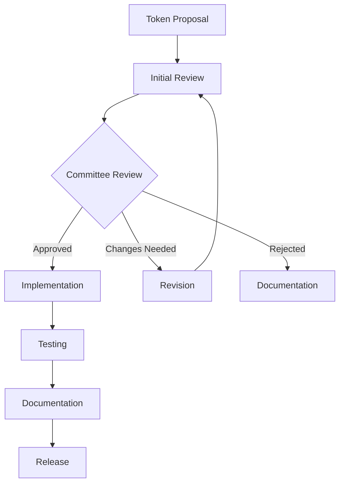

# Token Governance & Design System Standards

This document establishes governance standards, validation rules, and quality assurance processes for the n00plicate
design token system.

## Table of Contents

- [Governance Framework](#governance-framework)
- [Token Standards](#token-standards)
- [Validation Rules](#validation-rules)
- [Quality Assurance](#quality-assurance)
- [Review Process](#review-process)
- [Compliance Monitoring](#compliance-monitoring)

## Governance Framework

### Design Token Committee

The Design Token Committee oversees all token-related decisions:

**Core Members:**

- Design Lead (Chair)
- Senior Frontend Developer
- Mobile Platform Lead
- Design System Maintainer

**Responsibilities:**

- Review and approve new token proposals
- Establish naming conventions and standards
- Monitor token usage and adoption
- Plan deprecation and migration strategies

**Meeting Schedule:**

- Weekly review meetings
- Monthly planning sessions
- Quarterly roadmap reviews

### Decision Process

#### 1. Token Proposal Process



#### 2. Proposal Template

```markdown
# Token Proposal: [Token Name]

## Overview

Brief description of the proposed token(s).

## Justification

- **Problem**: What problem does this solve?
- **Use Cases**: Where will this token be used?
- **Impact**: What systems/components are affected?

## Specification

- **Type**: color | dimension | typography | shadow | etc.
- **Value**: Specific value(s)
- **Platforms**: web | mobile | desktop | all
- **Dependencies**: Other tokens this references

## Implementation Plan

- [ ] Define token in base.json
- [ ] Update platform-specific files
- [ ] Update Style Dictionary config
- [ ] Create usage documentation
- [ ] Add validation tests
- [ ] Update component examples

## Testing Strategy

- Visual regression testing plan
- Cross-platform validation
- Performance impact assessment

## Migration Plan

(If replacing existing tokens)

- Deprecation timeline
- Migration guide
- Breaking change communication

## Approval

- [ ] Design Lead approval
- [ ] Frontend Lead approval
- [ ] Mobile Lead approval
- [ ] Design System Maintainer approval
```

### Naming Conventions

#### Hierarchical Structure

```text
{category}.{subcategory}.{scale}.{variant}
```

**Examples:**

- `color.primary.500` - Primary color at 500 weight
- `spacing.component.button.padding` - Button-specific padding
- `typography.heading.h1.mobile` - Mobile-specific H1 typography

#### Category Standards

| Category     | Purpose                | Examples                                           |
| ------------ | ---------------------- | -------------------------------------------------- |
| `color`      | All color values       | `color.primary.500`, `color.semantic.error`        |
| `spacing`    | Margins, padding, gaps | `spacing.xs`, `spacing.component.card`             |
| `typography` | Font properties        | `typography.heading.h1`, `typography.body.regular` |
| `dimension`  | Sizes, widths, heights | `dimension.button.height.medium`                   |
| `border`     | Border properties      | `border.radius.medium`, `border.width.thick`       |
| `shadow`     | Drop shadows           | `shadow.elevation.medium`, `shadow.focus`          |
| `motion`     | Animation properties   | `motion.duration.fast`, `motion.easing.standard`   |

## Token Standards

### Core Principles

1. **Semantic Over Literal**: Use semantic names (`color.primary`) over literal ones (`color.blue`)
2. **Scale-Based**: Use consistent scales (xs, sm, md, lg, xl)
3. **Platform Agnostic**: Base tokens should work across all platforms
4. **Reference-Driven**: Use token references to maintain consistency

### Token Hierarchy

#### Tier 1: Primitive Tokens

Foundation tokens that define the raw values:

```json
{
  "color": {
    "blue": {
      "50": { "$type": "color", "$value": "#eff6ff" },
      "500": { "$type": "color", "$value": "#3b82f6" },
      "900": { "$type": "color", "$value": "#1e3a8a" }
    }
  },
  "font": {
    "family": {
      "sans": {
        "$type": "fontFamily",
        "$value": ["Inter", "system-ui", "sans-serif"]
      }
    },
    "size": {
      "16": { "$type": "dimension", "$value": "16px" }
    }
  }
}
```

#### Tier 2: Semantic Tokens

Purpose-driven tokens that reference primitives:

```json
{
  "color": {
    "primary": {
      "$type": "color",
      "$value": "{color.blue.500}",
      "$description": "Primary brand color"
    },
    "text": {
      "primary": {
        "$type": "color",
        "$value": "{color.gray.900}",
        "$description": "Primary text color"
      }
    }
  }
}
```

#### Tier 3: Component Tokens

Component-specific tokens for granular control:

```json
{
  "component": {
    "button": {
      "primary": {
        "background": {
          "$type": "color",
          "$value": "{color.primary}",
          "$description": "Primary button background"
        },
        "text": {
          "$type": "color",
          "$value": "{color.on.primary}",
          "$description": "Primary button text"
        }
      }
    }
  }
}
```

### Platform-Specific Extensions

Use `$extensions` for platform-specific values:

```json
{
  "spacing": {
    "medium": {
      "$type": "dimension",
      "$value": "16px",
      "$extensions": {
        "ios": {
          "$value": "16pt"
        },
        "android": {
          "$value": "16dp"
        },
        "compose": {
          "$value": "16.dp"
        }
      }
    }
  }
}
```

## Validation Rules

### Automated Validation

#### 1. Schema Validation

```typescript
// tools/validation/schema-validator.ts
import Ajv from 'ajv';
import { dtcgSchema } from './schemas/dtcg.json';

export class TokenSchemaValidator {
  private ajv: Ajv;

  constructor() {
    this.ajv = new Ajv({
      allErrors: true,
      verbose: true,
    });

    this.ajv.addSchema(dtcgSchema, 'dtcg');
  }

  validate(tokens: any): ValidationResult {
    const isValid = this.ajv.validate('dtcg', tokens);

    return {
      valid: isValid,
      errors: this.ajv.errors || [],
      warnings: this.generateWarnings(tokens),
    };
  }

  private generateWarnings(tokens: any): Warning[] {
    const warnings: Warning[] = [];

    // Check for missing descriptions
    this.checkMissingDescriptions(tokens, warnings);

    // Check naming conventions
    this.checkNamingConventions(tokens, warnings);

    // Check for circular references
    this.checkCircularReferences(tokens, warnings);

    return warnings;
  }
}
```

#### 2. Naming Convention Validation

```typescript
// tools/validation/naming-validator.ts
export class NamingValidator {
  private readonly VALID_CATEGORIES = [
    'color',
    'spacing',
    'typography',
    'dimension',
    'border',
    'shadow',
    'motion',
    'component',
  ];

  private readonly SCALE_PATTERNS = [
    /^(xxs|xs|sm|md|lg|xl|xxl)$/,
    /^(50|100|200|300|400|500|600|700|800|900)$/,
    /^(small|medium|large)$/,
  ];

  validateTokenPath(path: string[]): ValidationResult {
    const errors: string[] = [];

    // Category validation
    if (!this.VALID_CATEGORIES.includes(path[0])) {
      errors.push(`Invalid category: ${path[0]}`);
    }

    // Scale validation
    if (path.length > 2) {
      const scale = path[path.length - 1];
      const hasValidScale = this.SCALE_PATTERNS.some(pattern =>
        pattern.test(scale)
      );

      if (!hasValidScale) {
        errors.push(`Invalid scale: ${scale}`);
      }
    }

    // Reserved word check
    const reservedWords = ['$type', '$value', '$description', '$extensions'];
    const hasReservedWord = path.some(segment =>
      reservedWords.includes(segment)
    );

    if (hasReservedWord) {
      errors.push(`Path contains reserved word: ${path.join('.')}`);
    }

    return {
      valid: errors.length === 0,
      errors,
    };
  }
}
```

#### 3. Value Validation

```typescript
// tools/validation/value-validator.ts
export class ValueValidator {
  validateColorValue(value: string): boolean {
    const patterns = [
      /^#([A-Fa-f0-9]{3}){1,2}$/, // Hex
      /^rgb\(\s*\d+\s*,\s*\d+\s*,\s*\d+\s*\)$/, // RGB
      /^rgba\(\s*\d+\s*,\s*\d+\s*,\s*\d+\s*,\s*[\d.]+\s*\)$/, // RGBA
      /^hsl\(\s*\d+\s*,\s*\d+%\s*,\s*\d+%\s*\)$/, // HSL
      /^hsla\(\s*\d+\s*,\s*\d+%\s*,\s*\d+%\s*,\s*[\d.]+\s*\)$/, // HSLA
    ];

    return patterns.some(pattern => pattern.test(value));
  }

  validateDimensionValue(value: string): boolean {
    const pattern = /^-?\d*\.?\d+(px|em|rem|%|vh|vw|pt|dp)$/;
    return pattern.test(value);
  }

  validateFontWeightValue(value: string | number): boolean {
    if (typeof value === 'number') {
      return value >= 100 && value <= 900 && value % 100 === 0;
    }

    const validWeights = [
      'normal',
      'bold',
      'bolder',
      'lighter',
      '100',
      '200',
      '300',
      '400',
      '500',
      '600',
      '700',
      '800',
      '900',
    ];

    return validWeights.includes(value);
  }
}
```

### Manual Review Checklist

#### Design Review

- [ ] Tokens align with design system principles
- [ ] Visual hierarchy is maintained
- [ ] Accessibility standards are met
- [ ] Brand consistency is preserved

#### Technical Review

- [ ] Naming follows conventions
- [ ] Values are platform-appropriate
- [ ] References are valid
- [ ] Performance impact is acceptable

#### Documentation Review

- [ ] Usage examples are provided
- [ ] Migration guides are complete
- [ ] Breaking changes are documented
- [ ] Implementation notes are clear

## Quality Assurance

### Automated Testing

#### 1. Visual Regression Testing

```typescript
// tests/visual-regression/token-tests.ts
import { test, expect } from '@playwright/test';

test.describe('Design Token Visual Tests', () => {
  test('color tokens render correctly', async ({ page }) => {
    await page.goto('/storybook/?path=/story/tokens--colors');

    // Wait for tokens to load
    await page.waitForSelector('[data-testid="color-tokens"]');

    // Screenshot comparison
    await expect(page.locator('[data-testid="color-tokens"]')).toHaveScreenshot(
      'color-tokens.png'
    );
  });

  test('typography tokens scale properly', async ({ page }) => {
    await page.goto('/storybook/?path=/story/tokens--typography');

    // Test different viewport sizes
    const viewports = [
      { width: 375, height: 667 }, // Mobile
      { width: 768, height: 1024 }, // Tablet
      { width: 1440, height: 900 }, // Desktop
    ];

    for (const viewport of viewports) {
      await page.setViewportSize(viewport);
      await expect(
        page.locator('[data-testid="typography-scale"]')
      ).toHaveScreenshot(`typography-${viewport.width}.png`);
    }
  });
});
```

#### 2. Cross-Platform Validation

```typescript
// tests/cross-platform/token-consistency.test.ts
import { describe, it, expect } from 'vitest';
import { tokens as webTokens } from '@n00plicate/design-tokens/dist/web/tokens.json';
import { tokens as mobileTokens } from '@n00plicate/design-tokens/dist/mobile/tokens.json';

describe('Cross-Platform Token Consistency', () => {
  it('should have consistent color values across platforms', () => {
    const webColors = extractColors(webTokens);
    const mobileColors = extractColors(mobileTokens);

    Object.keys(webColors).forEach(colorKey => {
      expect(mobileColors[colorKey]).toBeDefined();
      expect(normalizeColorValue(webColors[colorKey])).toBe(
        normalizeColorValue(mobileColors[colorKey])
      );
    });
  });

  it('should have equivalent spacing scales', () => {
    const webSpacing = extractSpacing(webTokens);
    const mobileSpacing = extractSpacing(mobileTokens);

    // Convert all to base units for comparison
    Object.keys(webSpacing).forEach(spacingKey => {
      const webValue = convertToPixels(webSpacing[spacingKey]);
      const mobileValue = convertToPixels(mobileSpacing[spacingKey]);

      expect(Math.abs(webValue - mobileValue)).toBeLessThanOrEqual(1);
    });
  });
});
```

#### 3. Performance Testing

```typescript
// tests/performance/token-load-time.test.ts
import { performance } from 'perf_hooks';

describe('Token Performance', () => {
  it('should load tokens within performance budget', async () => {
    const startTime = performance.now();

    // Load tokens
    const tokens = await import('@n00plicate/design-tokens');

    const loadTime = performance.now() - startTime;

    // Should load within 50ms
    expect(loadTime).toBeLessThan(50);
  });

  it('should have acceptable bundle size', () => {
    const fs = require('fs');
    const path = require('path');

    const tokenFiles = [
      'dist/web/tokens.css',
      'dist/web/tokens.js',
      'dist/mobile/tokens.json',
    ];

    tokenFiles.forEach(file => {
      const filePath = path.join(
        __dirname,
        '../../packages/design-tokens',
        file
      );
      const stats = fs.statSync(filePath);
      const fileSizeKB = stats.size / 1024;

      // Each file should be under 100KB
      expect(fileSizeKB).toBeLessThan(100);
    });
  });
});
```

### Quality Metrics

#### 1. Token Coverage

Track token adoption across the codebase:

```typescript
// tools/metrics/token-coverage.ts
export class TokenCoverageAnalyzer {
  async analyzeUsage(): Promise<CoverageReport> {
    const allTokens = await this.getAllTokens();
    const usedTokens = await this.findUsedTokens();

    const coverage = (usedTokens.size / allTokens.size) * 100;

    return {
      totalTokens: allTokens.size,
      usedTokens: usedTokens.size,
      coverage: Math.round(coverage * 100) / 100,
      unusedTokens: Array.from(allTokens).filter(
        token => !usedTokens.has(token)
      ),
      orphanedTokens: await this.findOrphanedTokens(),
    };
  }

  private async findUsedTokens(): Promise<Set<string>> {
    const usedTokens = new Set<string>();

    // Scan source files for token usage
    const sourceFiles = await this.getSourceFiles();

    for (const file of sourceFiles) {
      const content = await fs.readFile(file, 'utf-8');
      const tokenReferences = this.extractTokenReferences(content);

      tokenReferences.forEach(token => usedTokens.add(token));
    }

    return usedTokens;
  }
}
```

#### 2. Quality Score

Calculate a quality score for the token system:

```typescript
// tools/metrics/quality-score.ts
export class QualityScoreCalculator {
  calculateScore(tokens: any): QualityScore {
    const scores = {
      naming: this.calculateNamingScore(tokens),
      consistency: this.calculateConsistencyScore(tokens),
      documentation: this.calculateDocumentationScore(tokens),
      usage: this.calculateUsageScore(tokens),
      performance: this.calculatePerformanceScore(tokens),
    };

    const weightedScore =
      scores.naming * 0.25 +
      scores.consistency * 0.25 +
      scores.documentation * 0.2 +
      scores.usage * 0.2 +
      scores.performance * 0.1;

    return {
      overall: Math.round(weightedScore),
      breakdown: scores,
      recommendations: this.generateRecommendations(scores),
    };
  }
}
```

## Review Process

### Pre-Commit Validation

```bash
#!/bin/bash
# .husky/pre-commit

echo "🔍 Validating design tokens..."

# Run token validation
pnpm run tokens:validate
if [ $? -ne 0 ]; then
  echo "❌ Token validation failed"
  exit 1
fi

# Check for breaking changes
pnpm run tokens:breaking-changes
if [ $? -eq 1 ]; then
  echo "⚠️  Breaking changes detected. Please update MIGRATION.md"
  exit 1
fi

# Run visual regression tests on token changes
if git diff --cached --name-only | grep -q "packages/design-tokens/"; then
  echo "🎨 Running visual regression tests..."
  pnpm run test:visual --changed-only
  if [ $? -ne 0 ]; then
    echo "❌ Visual regression tests failed"
    exit 1
  fi
fi

echo "✅ Token validation passed"
```

### Pull Request Template

```markdown
## Token Changes

### Type of Change

- [ ] New tokens
- [ ] Token value updates
- [ ] Token removals/deprecations
- [ ] Platform-specific changes
- [ ] Breaking changes

### Validation Checklist

- [ ] Schema validation passes
- [ ] Naming conventions followed
- [ ] Visual regression tests pass
- [ ] Cross-platform consistency verified
- [ ] Performance impact assessed
- [ ] Documentation updated
- [ ] Migration guide provided (if breaking)

### Impact Assessment

- **Affected Platforms**: web / mobile / desktop
- **Affected Components**: [list components]
- **Breaking Changes**: yes / no
- **Performance Impact**: none / minimal / significant

### Testing

- [ ] Storybook stories updated
- [ ] Visual tests pass
- [ ] Cross-platform tests pass
- [ ] Accessibility tests pass

### Documentation

- [ ] Usage examples provided
- [ ] API documentation updated
- [ ] Migration guide written
- [ ] Changelog updated
```

## Compliance Monitoring

### Continuous Monitoring

```typescript
// tools/monitoring/compliance-monitor.ts
export class ComplianceMonitor {
  async runDailyChecks(): Promise<ComplianceReport> {
    const checks = await Promise.all([
      this.checkTokenUsage(),
      this.checkNamingCompliance(),
      this.checkValueConsistency(),
      this.checkDocumentationCoverage(),
      this.checkPerformanceMetrics(),
    ]);

    const report = this.generateReport(checks);

    // Send alerts for compliance violations
    if (report.violations.length > 0) {
      await this.sendComplianceAlert(report);
    }

    return report;
  }

  private async sendComplianceAlert(report: ComplianceReport): Promise<void> {
    const message = `
🚨 Design Token Compliance Issues Detected

${report.violations.map(v => `• ${v.type}: ${v.message}`).join('\n')}

View full report: ${report.url}
    `;

    await this.slackNotifier.send('#design-system', message);
  }
}
```

### Reporting Dashboard

```typescript
// tools/dashboard/compliance-dashboard.ts
export class ComplianceDashboard {
  generateDashboard(): DashboardData {
    return {
      overview: {
        totalTokens: this.getTotalTokenCount(),
        coverage: this.getCoveragePercentage(),
        qualityScore: this.getQualityScore(),
        lastUpdated: new Date(),
      },

      metrics: {
        usage: this.getUsageMetrics(),
        performance: this.getPerformanceMetrics(),
        consistency: this.getConsistencyMetrics(),
      },

      alerts: this.getActiveAlerts(),

      trends: {
        coverage: this.getCoverageTrend(),
        quality: this.getQualityTrend(),
        adoption: this.getAdoptionTrend(),
      },
    };
  }
}
```

## Enforcement Policies

### Automated Enforcement

1. **Pre-commit hooks** prevent invalid tokens from being committed
2. **CI/CD pipelines** block merges that fail validation
3. **Automated PRs** for token updates and migrations
4. **Scheduled audits** identify compliance issues

### Manual Enforcement

1. **Quarterly reviews** of token system health
2. **Design critiques** include token usage review
3. **Code reviews** enforce token usage over hardcoded values
4. **Training sessions** on token best practices

## Next Steps

- [CI/CD Token Drift Detection](../cicd/token-drift-check.md)
- [Performance Monitoring](./performance.md)
- [Accessibility Testing](./accessibility.md)
- [Design Review Process](../design/review-process.md)

---

_This governance framework evolves with the design system and is reviewed quarterly by the Design Token Committee._
